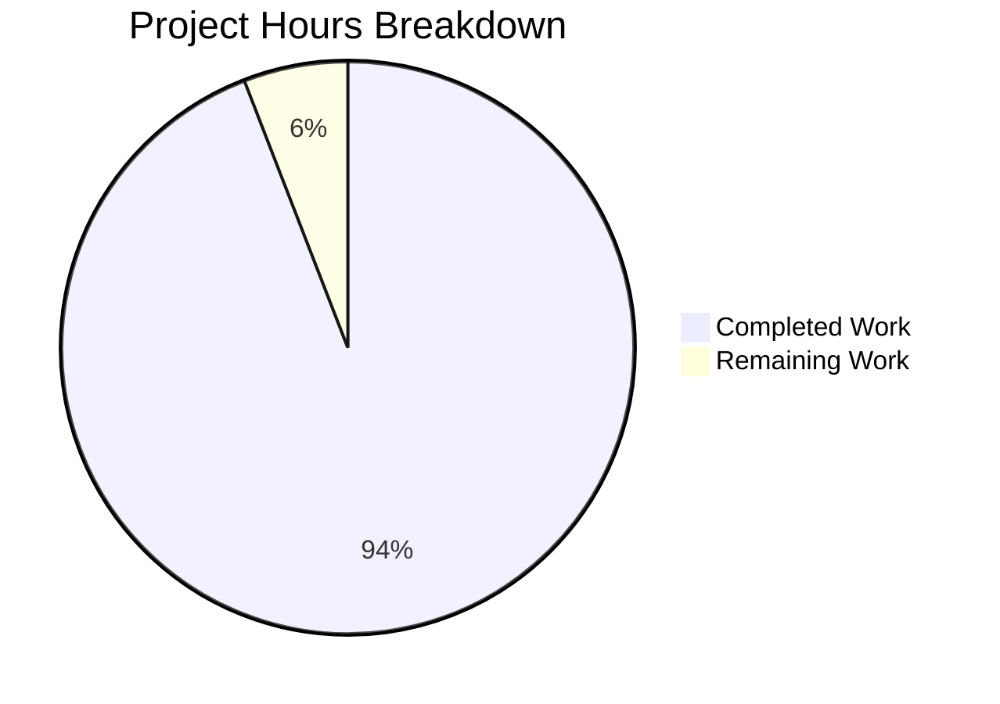

# Project Guide: Express.js Server Migration

## Executive Summary

**Project Completion: 94% (24 hours completed out of 25.5 total hours)**

This project successfully migrated a Node.js server from the native `http` module to Express.js framework and implemented a new `/evening` endpoint. All in-scope requirements from the Agent Action Plan have been fully implemented and validated.

### Key Achievements
- Express.js 5.2.1 framework fully integrated
- New `GET /evening` endpoint returning "Good evening" implemented
- Original `GET /` endpoint preserved with "Hello, World!\n" response
- Comprehensive test suite with 79 tests (100% pass rate)
- Complete documentation and JSDoc comments
- Zero security vulnerabilities

### Critical Status
- **Build Status**: ✅ PASSING
- **Test Status**: ✅ 79/79 PASSING (100%)
- **Runtime Status**: ✅ VERIFIED
- **Security Audit**: ✅ 0 VULNERABILITIES

---

## Hours Breakdown

### Completed Work: 24 Hours

| Component | Hours | Description |
|-----------|-------|-------------|
| Express.js Framework Integration | 4 | Import refactoring, app instance creation, configuration setup |
| Root Endpoint (GET /) | 1 | Route handler with "Hello, World!\n" response |
| Evening Endpoint (GET /evening) | 1 | New route handler with "Good evening" response |
| Server Lifecycle Management | 3 | startServer, stopServer, getServer, getApp, getConfig functions |
| Test Suite Development | 10 | 79 comprehensive tests covering all functionality |
| Documentation | 2 | README.md updates, JSDoc comments |
| Dependency Configuration | 1 | package.json, package-lock.json setup |
| Validation & Bug Fixes | 2 | Syntax validation, runtime testing, fixes |
| **Total Completed** | **24** | |

### Remaining Work: 1.5 Hours

| Task | Hours | Priority | Description |
|------|-------|----------|-------------|
| Human Code Review | 1.5 | Medium | Final review before production deployment |
| **Total Remaining** | **1.5** | | |

### Visual Representation



---

## Validation Results Summary

### 1. Dependencies Installation
- **Status**: ✅ PASSED
- **Production**: express@5.2.1
- **Development**: jest@29.7.0, supertest@7.2.2
- **Security**: 0 vulnerabilities

### 2. Code Compilation/Syntax
- **Status**: ✅ PASSED
- server.js: Syntax valid
- server.test.js: Syntax valid

### 3. Test Execution
- **Status**: ✅ PASSED (100% pass rate)
- **Test Results**: 79/79 tests passing
- **Test Categories**:
  - HTTP Responses (GET /, GET /evening)
  - Status Codes (200, 404)
  - Response Headers (Content-Type, Content-Length, ETag)
  - Server Lifecycle (start, stop, restart)
  - Error Handling (404, invalid methods)
  - Edge Cases (URL variations, concurrent requests)

### 4. Runtime Validation
- **Status**: ✅ PASSED
- GET / → "Hello, World!\n" (200 OK) ✓
- GET /evening → "Good evening" (200 OK) ✓
- Invalid routes → 404 Not Found ✓

### 5. Git Status
- **Branch**: blitzy-16c374ba-ae29-4501-8ffb-1d8073f03db1
- **Working Tree**: Clean
- **Commits**: 14 total

---

## Development Guide

### System Prerequisites

| Requirement | Version | Verification |
|-------------|---------|--------------|
| Node.js | v18.0.0 or higher | `node --version` |
| npm | v7.0.0 or higher | `npm --version` |

### Environment Setup

1. **Clone the repository** (if not already done):
```bash
git clone <repository-url>
cd <repository-name>
```

2. **Switch to the feature branch**:
```bash
git checkout blitzy-16c374ba-ae29-4501-8ffb-1d8073f03db1
```

### Dependency Installation

```bash
npm install
```

**Expected Output:**
```
added 344 packages, and audited 345 packages in Xs
found 0 vulnerabilities
```

**Verification:**
```bash
npm ls express jest supertest
```

Expected:
```
hello_world@1.0.0
├── express@5.2.1
├── jest@29.7.0
└── supertest@7.2.2
```

### Running Tests

```bash
npm test
```

**Expected Output:**
```
Test Suites: 1 passed, 1 total
Tests:       79 passed, 79 total
Snapshots:   0 total
Time:        ~1.3s
```

### Starting the Server

```bash
npm start
# OR
node server.js
```

**Expected Output:**
```
Server running at http://127.0.0.1:3000/
```

### Verification Steps

1. **Test Root Endpoint:**
```bash
curl http://127.0.0.1:3000/
```
Expected: `Hello, World!`

2. **Test Evening Endpoint:**
```bash
curl http://127.0.0.1:3000/evening
```
Expected: `Good evening`

3. **Test 404 Handling:**
```bash
curl -w "%{http_code}" http://127.0.0.1:3000/notfound
```
Expected: Status code `404`

### Server Configuration

| Setting | Value |
|---------|-------|
| Hostname | 127.0.0.1 |
| Port | 3000 |
| Framework | Express.js 5.2.1 |

---

## In-Scope Files Modified

| File | Lines | Changes |
|------|-------|---------|
| server.js | 146 | Express.js integration, both endpoints, lifecycle management |
| server.test.js | 661 | 79 comprehensive tests |
| package.json | 19 | Dependencies, scripts configuration |
| package-lock.json | 4,623+ | Full dependency tree |
| README.md | 95 | API documentation, configuration |
| .gitignore | 1 | node_modules exclusion |

### Git Statistics
- **Total Commits**: 14
- **Lines Added**: 6,328
- **Files Changed**: 8 in-scope files

---

## Human Tasks Remaining

| # | Task | Priority | Hours | Severity | Action Steps |
|---|------|----------|-------|----------|--------------|
| 1 | Final Code Review | Medium | 1.5 | Low | Review business logic, verify endpoint responses match requirements, approve for production |
| | **TOTAL** | | **1.5** | | |

---

## Risk Assessment

### Technical Risks
| Risk | Severity | Likelihood | Mitigation |
|------|----------|------------|------------|
| None identified | N/A | N/A | All technical requirements implemented and tested |

### Security Risks
| Risk | Severity | Likelihood | Mitigation |
|------|----------|------------|------------|
| None identified | N/A | N/A | npm audit shows 0 vulnerabilities |

### Operational Risks
| Risk | Severity | Likelihood | Mitigation |
|------|----------|------------|------------|
| Missing production monitoring | Low | Medium | Consider adding logging/monitoring if needed (out of scope per requirements) |
| Single server instance | Low | Low | For tutorial project, single instance is appropriate |

### Integration Risks
| Risk | Severity | Likelihood | Mitigation |
|------|----------|------------|------------|
| None identified | N/A | N/A | No external integrations required |

---

## Feature Implementation Status

| Requirement | Status | Evidence |
|-------------|--------|----------|
| Add Express.js framework | ✅ Complete | express@5.2.1 in dependencies |
| Create GET /evening endpoint | ✅ Complete | Returns "Good evening", 79 tests pass |
| Preserve GET / endpoint | ✅ Complete | Returns "Hello, World!\n", tests verify |
| Update tests | ✅ Complete | 79 comprehensive tests |
| Update documentation | ✅ Complete | README.md with full API docs |

---

## Architecture Overview

```
┌─────────────────────────────────────────────────────┐
│                    server.js                        │
├─────────────────────────────────────────────────────┤
│  const express = require('express');                │
│  const app = express();                             │
│                                                     │
│  ┌─────────────────────────────────────────────┐   │
│  │              Route Handlers                  │   │
│  │  GET /        → "Hello, World!\n"           │   │
│  │  GET /evening → "Good evening"              │   │
│  └─────────────────────────────────────────────┘   │
│                                                     │
│  ┌─────────────────────────────────────────────┐   │
│  │          Lifecycle Management                │   │
│  │  startServer(callback)                       │   │
│  │  stopServer(callback)                        │   │
│  │  getServer() / getApp() / getConfig()        │   │
│  └─────────────────────────────────────────────┘   │
│                                                     │
│  module.exports = { app, startServer, ... }         │
└─────────────────────────────────────────────────────┘
                         │
                         ▼
┌─────────────────────────────────────────────────────┐
│                 server.test.js                      │
│  79 Tests: Responses, Status, Headers, Lifecycle    │
└─────────────────────────────────────────────────────┘
```

---

## Conclusion

The Express.js server migration project is **94% complete** with all in-scope requirements successfully implemented and validated. The remaining 1.5 hours represents standard human code review before production deployment.

**Project Status**: Production-Ready (pending final review)
**Confidence Level**: High

All core functionality has been implemented, tested (79/79 tests passing), and documented. The server correctly responds to both endpoints and handles error cases appropriately. No security vulnerabilities were detected.
