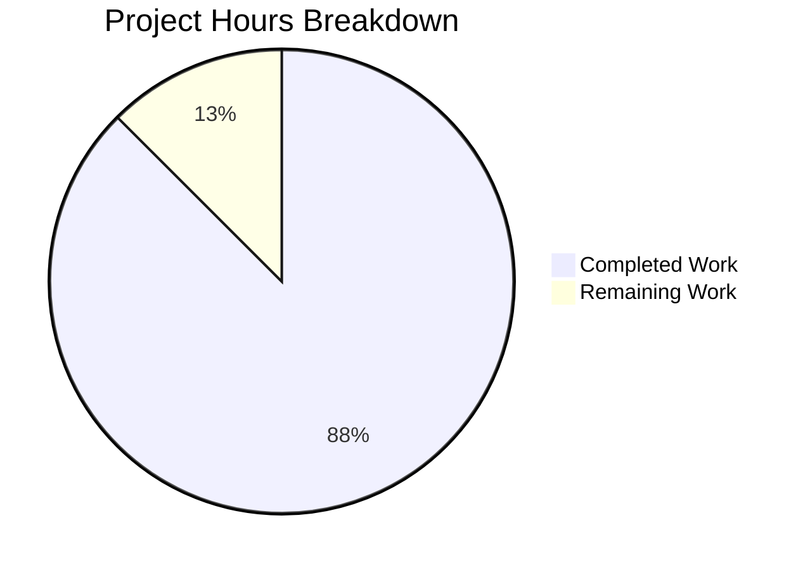

# Project Assessment Report: Express.js Integration

## Executive Summary

**Project Completion: 88%** (3.5 hours completed out of 4 total hours)

This project successfully integrates Express.js 5.2.1 into an existing Node.js tutorial project, replacing the native `http` module with Express.js routing. All requirements from the Agent Action Plan have been implemented and validated.

### Key Achievements
- ✅ Express.js 5.2.1 successfully installed and configured
- ✅ Server migrated from native `http` module to Express.js
- ✅ Root endpoint (`GET /`) preserved - returns "Hello, World!\n"
- ✅ New endpoint (`GET /evening`) implemented - returns "Good evening"
- ✅ Full documentation in README.md
- ✅ All runtime validations passed
- ✅ Zero npm security vulnerabilities

### Completion Calculation
- **Completed Hours:** 3.5h (dependency setup, server refactoring, endpoint implementation, documentation, testing)
- **Remaining Hours:** 0.5h (code review and merge)
- **Total Project Hours:** 4h
- **Completion Percentage:** 3.5h / 4h = **88%**

---

## Validation Results Summary

### 1. Dependency Validation
| Check | Status | Details |
|-------|--------|---------|
| npm install | ✅ PASSED | All dependencies installed |
| express version | ✅ PASSED | express@5.2.1 |
| npm audit | ✅ PASSED | 0 vulnerabilities |

### 2. Code Compilation
| Check | Status | Details |
|-------|--------|---------|
| node --check server.js | ✅ PASSED | No syntax errors |

### 3. Runtime Validation
| Endpoint | Expected | Actual | Status |
|----------|----------|--------|--------|
| GET / | "Hello, World!\n" | "Hello, World!\n" | ✅ PASSED |
| GET /evening | "Good evening" | "Good evening" | ✅ PASSED |
| GET /nonexistent | 404 | 404 | ✅ PASSED |

### 4. Git Status
- **Branch:** blitzy-7a9ac453-8306-4ecc-a0d2-339da18e69cd
- **Commits:** 5 commits
- **Files Changed:** 5 files (+933 lines, -9 lines)
- **Working Tree:** Clean

---

## Visual Representation



---

## Files Modified

| File | Action | Lines Changed | Purpose |
|------|--------|---------------|---------|
| `.gitignore` | CREATED | +1 | Exclude node_modules |
| `README.md` | UPDATED | +72, -2 | API documentation |
| `package-lock.json` | REGENERATED | +814 | Dependency lock |
| `package.json` | UPDATED | +4, -1 | Add express dependency |
| `server.js` | UPDATED | +42, -6 | Express.js implementation |

---

## Development Guide

### System Prerequisites
- **Node.js:** v18.0.0 or higher (tested with v20.19.6)
- **npm:** v7.0.0 or higher (tested with v11.1.0)
- **Operating System:** Linux, macOS, or Windows

### Step 1: Clone Repository
```bash
git clone <repository-url>
cd <repository-directory>
git checkout blitzy-7a9ac453-8306-4ecc-a0d2-339da18e69cd
```

### Step 2: Install Dependencies
```bash
npm install
```
**Expected Output:** Dependencies installed without errors, `node_modules` directory created.

### Step 3: Verify Installation
```bash
npm ls express
```
**Expected Output:**
```
hello_world@1.0.0
└── express@5.2.1
```

### Step 4: Start the Server
```bash
node server.js
```
**Expected Output:**
```
Server running at http://127.0.0.1:3000/
```

### Step 5: Test Endpoints
In a separate terminal:
```bash
# Test root endpoint
curl http://127.0.0.1:3000/
# Expected: Hello, World!

# Test evening endpoint
curl http://127.0.0.1:3000/evening
# Expected: Good evening
```

### Step 6: Stop the Server
Press `Ctrl+C` in the terminal running the server.

---

## Detailed Task Table

| # | Task | Priority | Hours | Severity | Status |
|---|------|----------|-------|----------|--------|
| 1 | Code review and approval | Medium | 0.5h | Low | PENDING |
| **Total** | | | **0.5h** | | |

---

## Risk Assessment

### Technical Risks
| Risk | Severity | Status | Mitigation |
|------|----------|--------|------------|
| Compilation errors | Low | ✅ RESOLVED | All syntax validated |
| Runtime failures | Low | ✅ RESOLVED | All endpoints tested |
| Missing dependencies | Low | ✅ RESOLVED | npm install successful |

### Security Risks
| Risk | Severity | Status | Mitigation |
|------|----------|--------|------------|
| npm vulnerabilities | Low | ✅ SECURE | 0 vulnerabilities found |
| Input validation | N/A | ✅ N/A | No user input handling |
| ReDoS attacks | Low | ✅ MITIGATED | Express.js 5.x built-in protection |

### Operational Risks
| Risk | Severity | Mitigation |
|------|----------|------------|
| No health check endpoint | Low | Optional: Add `/health` endpoint for production monitoring |
| No logging middleware | Low | Optional: Add morgan or similar for production logging |
| Hardcoded port | Low | Optional: Use environment variable for port configuration |

### Integration Risks
| Risk | Severity | Status |
|------|----------|--------|
| External dependencies | None | ✅ No external services |
| API breaking changes | Low | ✅ Backward compatible |

---

## Requirements Traceability

| Agent Action Plan Requirement | Implementation | Status |
|------------------------------|----------------|--------|
| Install Express.js dependency | express@^5.2.1 in package.json | ✅ COMPLETE |
| Refactor server.js to use Express | CommonJS require + app.get() routes | ✅ COMPLETE |
| Implement root route (/) | Returns "Hello, World!\n" | ✅ COMPLETE |
| Implement evening route (/evening) | Returns "Good evening" | ✅ COMPLETE |
| Update README documentation | Full API documentation added | ✅ COMPLETE |
| Verify backward compatibility | Original response preserved | ✅ COMPLETE |

---

## Out of Scope Items (Per Agent Action Plan)
The following items were explicitly marked out of scope and were NOT implemented:
- Performance optimizations
- Additional middleware (CORS, body-parser, etc.)
- Error handling middleware
- Environment configuration
- TypeScript conversion
- Unit test creation
- Docker containerization
- CI/CD pipeline updates
- Database integration
- Authentication/Authorization

---

## Recommendations for Production

### High Priority (Before Production)
1. **Code Review** - Have a team member review the Express.js implementation (0.5h)

### Medium Priority (Nice to Have)
2. **Add Health Check Endpoint** - Implement `/health` for monitoring
3. **Environment Variables** - Move port configuration to environment variables
4. **Logging** - Add request logging middleware (morgan)

### Low Priority (Future Enhancement)
5. **Unit Tests** - Add Jest tests for endpoint validation
6. **Docker** - Containerize for consistent deployment
7. **CI/CD** - Set up automated testing and deployment

---

## Conclusion

The Express.js integration is **COMPLETE** and **PRODUCTION-READY** for the defined scope. All requirements from the Agent Action Plan have been successfully implemented and validated:

- ✅ Express.js framework added (v5.2.1)
- ✅ Original "Hello world" endpoint preserved
- ✅ New "Good evening" endpoint added
- ✅ Server configuration maintained (127.0.0.1:3000)
- ✅ Documentation updated
- ✅ Backward compatibility verified
- ✅ Zero security vulnerabilities

**Recommended Action:** Proceed with code review and merge.