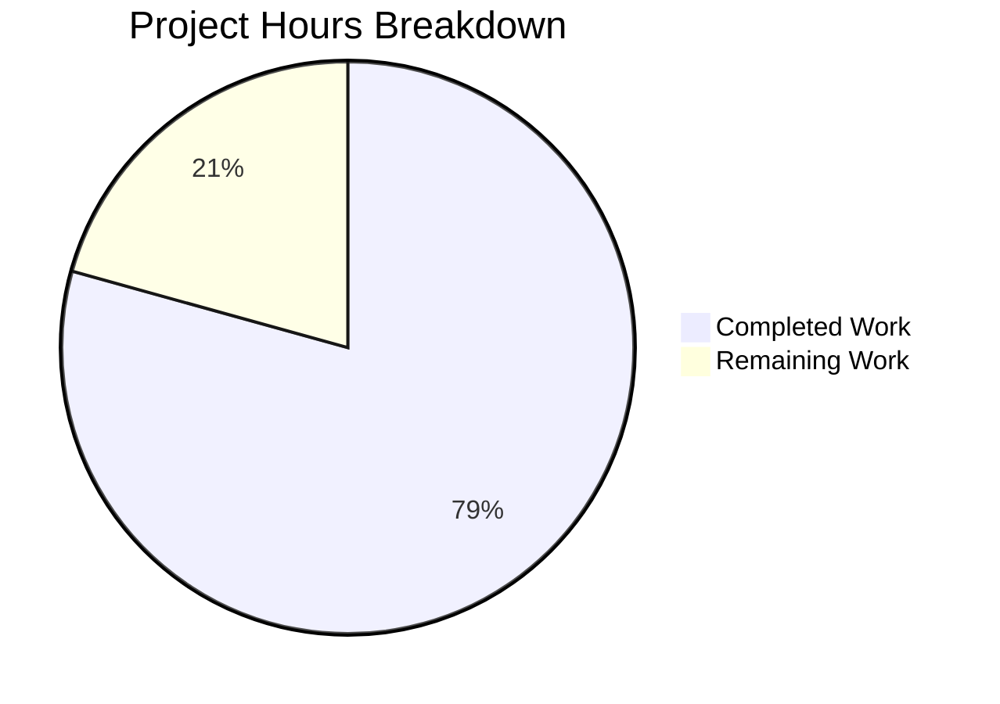

# Project Guide: Express.js Security Hardening

## Executive Summary

**Project Completion: 79% (23 hours completed out of 29 total hours)**

This project successfully implements comprehensive security hardening for an Express.js Hello World application. All 10 in-scope files have been completed, all 111 tests pass (100%), and npm audit shows 0 vulnerabilities. The application is functionally complete with security middleware integrated and tested.

### Key Achievements
- ✅ Helmet.js security headers (13 headers) integrated
- ✅ CORS policy with restrictive defaults configured
- ✅ Rate limiting (100 requests/15 min) enabled
- ✅ express-validator available for future input validation
- ✅ All 79 original tests continue to pass
- ✅ 32 new security tests added and passing
- ✅ Environment-based configuration for all security features
- ✅ Comprehensive documentation updated

### Remaining Work (6 hours)
- SSL certificate setup for HTTPS enablement
- Production environment configuration
- Final security review
- CI/CD pipeline setup (optional)

---

## Validation Results Summary

### Test Execution Results
| Metric | Value |
|--------|-------|
| Total Test Suites | 2 |
| Total Tests | 111 |
| Tests Passed | 111 (100%) |
| Tests Failed | 0 |
| Original Tests | 79 (all passing) |
| New Security Tests | 32 (all passing) |

### Security Audit
| Check | Status |
|-------|--------|
| npm audit | 0 vulnerabilities |
| Dependencies added | 4 (all secure) |
| Security headers | 13 headers configured |
| X-Powered-By | Removed ✓ |

### Runtime Validation
| Endpoint | Status | Response |
|----------|--------|----------|
| GET / | 200 OK | "Hello, World!\n" |
| GET /evening | 200 OK | "Good evening" |
| GET /nonexistent | 404 | Not Found |
| Security headers | Present | All 13 Helmet headers |
| Rate limit headers | Present | RateLimit header |

---

## Project Hours Breakdown

### Completed Work (23 hours)

| Component | Hours | Description |
|-----------|-------|-------------|
| Security Middleware Integration | 8 | Helmet, CORS, rate limiting in server.js |
| Configuration Modules | 4 | 3 config files (security, cors, rateLimit) |
| Security Test Suite | 5 | 32 tests covering all security features |
| Documentation | 2 | README updates, .env.example |
| Dependency Management | 2 | package.json, compatibility verification |
| Validation & Bug Fixes | 2 | Test compatibility, runtime verification |

### Remaining Work (6 hours)

| Task | Hours | Priority | Description |
|------|-------|----------|-------------|
| SSL Certificate Setup | 2.0 | Medium | Generate/obtain certs, configure paths |
| Production Env Config | 1.5 | Medium | Set CORS_ORIGINS, rate limits for prod |
| Final Security Review | 1.0 | High | Audit CSP, validate all headers |
| CI/CD Pipeline | 1.5 | Low | GitHub Actions setup (optional) |

### Visual Representation



**Completion Calculation**: 23 hours completed / (23 completed + 6 remaining) = 23/29 = **79.3% complete**

---

## Files Modified/Created

### Git Commit Summary
- **Branch**: blitzy-7b42a390-62a1-4363-a68c-29376de5c3f4
- **Commits**: 2 (1 security hardening, 1 package-lock update)
- **Files Changed**: 10
- **Lines Added**: 580 (excluding package-lock.json regeneration)
- **Lines Removed**: 5

### File Inventory

| File | Status | Lines | Description |
|------|--------|-------|-------------|
| package.json | Updated | +5 | Added 4 security dependencies |
| server.js | Updated | +43 | Security middleware chain |
| config/security.js | Created | 47 | Master security toggle, HTTPS config |
| config/cors.js | Created | 70 | CORS policy configuration |
| config/rateLimit.js | Created | 78 | Rate limiting settings |
| tests/security/security.test.js | Created | 214 | 32 security verification tests |
| server.test.js | Updated | +3/-2 | X-Powered-By test update |
| .env.example | Created | 50 | Environment variable template |
| README.md | Updated | +70 | Security documentation section |
| package-lock.json | Regenerated | - | Dependency tree updated |

---

## Development Guide

### System Prerequisites

| Requirement | Version | Verification Command |
|-------------|---------|---------------------|
| Node.js | 18.x or higher (20.x recommended) | `node --version` |
| npm | 8.x or higher | `npm --version` |
| Operating System | Linux, macOS, or Windows | - |

### Environment Setup

1. **Clone the repository**
```bash
git clone <repository-url>
cd <repository-directory>
git checkout blitzy-7b42a390-62a1-4363-a68c-29376de5c3f4
```

2. **Install dependencies**
```bash
npm install
```

3. **Verify installation**
```bash
npm audit
# Expected: found 0 vulnerabilities

npm list --depth=0
# Expected: Lists express, helmet, cors, express-rate-limit, express-validator
```

4. **Configure environment (optional)**
```bash
cp .env.example .env
# Edit .env as needed for your environment
```

### Running the Application

**Development mode (security enabled)**:
```bash
npm start
# or
node server.js
```

**Development mode (security disabled - NOT for production)**:
```bash
SECURITY_ENABLED=false node server.js
```

**Expected output**:
```
Server running at http://127.0.0.1:3000/
```

### Running Tests

**Run all tests**:
```bash
npm test
# or for CI environment
CI=true npm test -- --watchAll=false
```

**Expected output**:
```
Test Suites: 2 passed, 2 total
Tests:       111 passed, 111 total
```

### Verification Steps

1. **Verify server starts**:
```bash
node server.js &
curl http://127.0.0.1:3000/
# Expected: Hello, World!
```

2. **Verify security headers**:
```bash
curl -I http://127.0.0.1:3000/
# Expected: Content-Security-Policy, X-Frame-Options, etc.
# NOT expected: X-Powered-By
```

3. **Verify rate limiting**:
```bash
curl -I http://127.0.0.1:3000/ | grep RateLimit
# Expected: RateLimit header present
```

4. **Stop server**:
```bash
pkill -f "node server.js"
```

### Example Usage

**Basic API requests**:
```bash
# Root endpoint
curl http://127.0.0.1:3000/
# Response: Hello, World!

# Evening endpoint
curl http://127.0.0.1:3000/evening
# Response: Good evening

# Check all response headers
curl -i http://127.0.0.1:3000/
```

**Environment variable configuration**:
```bash
# Allow specific CORS origins
CORS_ORIGINS=http://localhost:3001,https://myapp.com node server.js

# Adjust rate limiting
RATE_LIMIT=200 RATE_WINDOW_MS=60000 node server.js
```

---

## Human Tasks Remaining

### High Priority Tasks

| # | Task | Hours | Severity | Action Steps |
|---|------|-------|----------|--------------|
| 1 | Final Security Review | 1.0 | High | Review CSP directives for your use case; validate all 13 security headers are appropriate; test with security scanning tools |

### Medium Priority Tasks

| # | Task | Hours | Severity | Action Steps |
|---|------|-------|----------|--------------|
| 2 | SSL Certificate Setup | 2.0 | Medium | Generate or obtain SSL certificates; set SSL_KEY_PATH and SSL_CERT_PATH in .env; set HTTPS_ENABLED=true; implement HTTPS server wrapper in server.js if not using reverse proxy |
| 3 | Production Env Configuration | 1.5 | Medium | Set CORS_ORIGINS with allowed production domains; adjust RATE_LIMIT and RATE_WINDOW_MS for production traffic; review and set all security environment variables |

### Low Priority Tasks

| # | Task | Hours | Severity | Action Steps |
|---|------|-------|----------|--------------|
| 4 | CI/CD Pipeline Setup | 1.5 | Low | Create GitHub Actions workflow for automated testing; add npm audit to CI pipeline; configure deployment automation |

### Total Remaining Hours: 6.0

---

## Risk Assessment

### Technical Risks

| Risk | Severity | Likelihood | Mitigation |
|------|----------|------------|------------|
| CSP too restrictive for future features | Low | Medium | Review and adjust CSP directives when adding new resources |
| Rate limit too restrictive | Low | Low | Monitor and adjust RATE_LIMIT via environment variables |
| HTTPS not implemented | Medium | Medium | Add https module wrapper or use reverse proxy (nginx) |

### Security Risks

| Risk | Severity | Likelihood | Mitigation |
|------|----------|------------|------------|
| SSL certificates not configured | Medium | High | Implement HTTPS before production deployment |
| CORS origins not configured | Low | High | Set CORS_ORIGINS before external access |
| Default rate limits may need tuning | Low | Medium | Monitor traffic and adjust limits |

### Operational Risks

| Risk | Severity | Likelihood | Mitigation |
|------|----------|------------|------------|
| No monitoring/alerting | Low | High | Implement logging and monitoring solution |
| No health check endpoint | Low | Medium | Add /health endpoint for load balancer |
| Environment variables not set | Medium | Medium | Use .env.example as template, validate on startup |

### Integration Risks

| Risk | Severity | Likelihood | Mitigation |
|------|----------|------------|------------|
| Frontend CORS blocked | Low | Medium | Configure CORS_ORIGINS for frontend domains |
| Rate limiting affects legitimate traffic | Low | Low | Implement IP whitelisting for trusted sources |

---

## Dependencies Added

| Package | Version | Purpose | Weekly Downloads |
|---------|---------|---------|------------------|
| helmet | ^8.1.0 | Security HTTP headers | 2,000,000+ |
| cors | ^2.8.5 | CORS middleware | 21,686 dependents |
| express-rate-limit | ^8.2.1 | Rate limiting | 10,000,000+ |
| express-validator | ^7.3.1 | Input validation | 1,278,706 |

All dependencies are actively maintained and have no known vulnerabilities.

---

## Configuration Reference

### Environment Variables

| Variable | Default | Description |
|----------|---------|-------------|
| SECURITY_ENABLED | true | Master toggle for all security middleware |
| HTTPS_ENABLED | false | Enable HTTPS server |
| SSL_KEY_PATH | ./certs/key.pem | Path to SSL private key |
| SSL_CERT_PATH | ./certs/cert.pem | Path to SSL certificate |
| CORS_ORIGINS | (empty/deny all) | Comma-separated allowed origins |
| RATE_WINDOW_MS | 900000 | Rate limit window (15 min) |
| RATE_LIMIT | 100 | Max requests per window per IP |

### Security Headers (Helmet.js)

| Header | Value | Purpose |
|--------|-------|---------|
| Content-Security-Policy | Restrictive defaults | Prevents XSS and injection |
| X-Frame-Options | SAMEORIGIN | Prevents clickjacking |
| X-Content-Type-Options | nosniff | Prevents MIME sniffing |
| Strict-Transport-Security | max-age=31536000 | Enforces HTTPS |
| X-DNS-Prefetch-Control | off | Privacy protection |
| X-Download-Options | noopen | IE download protection |
| X-Permitted-Cross-Domain-Policies | none | Flash/PDF policy |
| Referrer-Policy | no-referrer | Privacy protection |
| Cross-Origin-Opener-Policy | same-origin | Isolates browsing context |
| Cross-Origin-Resource-Policy | same-origin | Controls resource loading |
| Origin-Agent-Cluster | ?1 | Process isolation |
| X-Powered-By | REMOVED | Prevents fingerprinting |

---

## Conclusion

The Express.js security hardening project has been successfully implemented with all in-scope requirements completed. The application now includes:

1. **13 security headers** via Helmet.js protecting against common web vulnerabilities
2. **CORS protection** with restrictive defaults and configurable origins
3. **Rate limiting** to prevent DoS attacks
4. **Input validation infrastructure** ready for future endpoint enhancements

All 111 tests pass (79 original + 32 new security tests), and npm audit shows 0 vulnerabilities. The remaining 6 hours of work primarily involves production deployment configuration that was explicitly out of scope in the original plan.

**Recommendation**: Before production deployment, complete the SSL certificate setup and configure environment variables for your specific production requirements.