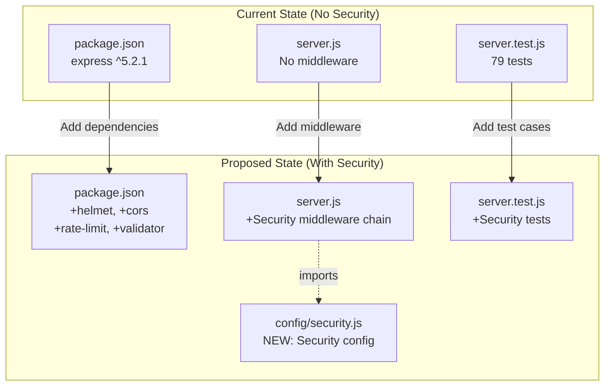
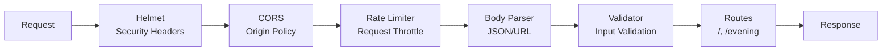
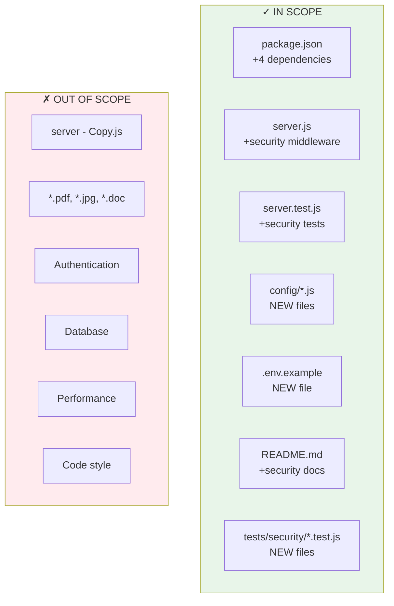

# Technical Specification

# 0. Agent Action Plan

## 0.1 Intent Clarification

### 0.1.1 Core Security Objective

Based on the security concern described, the Blitzy platform understands that the security vulnerability to resolve is **the absence of comprehensive security hardening** in the current Express.js application. The user's request encompasses multiple security enhancement categories:

- **Vulnerability category**: Multiple vulnerabilities (Configuration weakness + Dependency requirements + Code-level security gaps)
- **Severity level**: Medium - The application currently operates as a localhost-only test server with no production exposure, but the requested security enhancements are industry best practices
- **Current security posture**: The existing technical specification (Section 6.4) explicitly documents security architecture as "Not Applicable" with features like HTTPS, Authentication, and Security Headers marked as "Out of Scope"

**Security Requirements with Enhanced Clarity**:

| Requirement | User Request | Technical Interpretation |
|-------------|--------------|-------------------------|
| Security Headers | "Implement security headers" | Add HTTP response headers (CSP, HSTS, X-Content-Type-Options, etc.) via Helmet.js middleware |
| Input Validation | "Input validation" | Implement request validation middleware using express-validator |
| Rate Limiting | "Rate limiting" | Add express-rate-limit middleware to prevent brute-force attacks |
| HTTPS Support | "HTTPS support" | Enable TLS/SSL termination with configurable certificates |
| Dependencies | "Update dependencies" | Audit and update production/dev dependencies to secure versions |
| Helmet.js | "Add helmet.js" | Integrate Helmet.js ^8.1.0 for security header management |
| CORS | "Configure proper CORS policies" | Add cors middleware with restrictive origin policies |

**Implicit Security Needs Surfaced**:
- Backward compatibility with existing 79 passing tests
- Zero downtime requirement (test project nature)
- Preserve existing API responses ("Hello, World!\n" and "Good evening")
- Maintain CommonJS module compatibility
- Keep localhost binding as default while enabling external access configuration

### 0.1.2 Special Instructions and Constraints

**Critical Directives Captured**:
- Minimal changes philosophy: Security features should be added as middleware without modifying core endpoint logic
- Maintain API compatibility: Existing responses must remain unchanged
- No breaking changes: All 79 existing tests must continue to pass

**Security Requirements**:
- Follow OWASP Express.js security best practices
- Implement defense-in-depth through multiple security layers
- Ensure all security middleware is configurable for different environments

**User Examples Preserved**: None provided directly; the request is a high-level security enhancement directive.

**Web Search Requirements Documented**:
- ✓ Helmet.js latest version and configuration options
- ✓ express-rate-limit latest version and implementation patterns
- ✓ cors package latest version and configuration
- ✓ express-validator latest version for input validation

**Change Scope Preferences**: Standard - Add all requested security features while preserving existing functionality

### 0.1.3 Technical Interpretation

"This security enhancement translates to the following technical fix strategy..."

The user's request requires a comprehensive security middleware layer to be integrated into the existing Express.js application. This transforms the application from a minimal test server to a security-hardened service following industry best practices.

**Requirement-to-Action Mapping**:

| Requirement | Technical Action |
|-------------|-----------------|
| Security headers | Integrate `helmet@^8.1.0` as first middleware in Express chain |
| Input validation | Add `express-validator@^7.3.1` for request body/query validation |
| Rate limiting | Configure `express-rate-limit@^8.2.1` with appropriate thresholds |
| HTTPS support | Create HTTPS server wrapper using Node.js `https` module |
| Dependencies | Update `package.json` with security packages |
| Helmet.js | Configure with sensible defaults for CSP, HSTS, XSS protection |
| CORS policies | Implement `cors@^2.8.5` with configurable origin whitelist |

**Understanding Level Assessment**: Explicit feature request - User has clearly specified the security features needed without referencing specific CVEs or vulnerabilities. This is a proactive security enhancement rather than a reactive vulnerability fix.

## 0.2 Vulnerability Research and Analysis

### 0.2.1 Initial Assessment

**Security-Related Information Extracted**:

- **CVE numbers mentioned**: None - This is a proactive security enhancement request
- **Vulnerability names**: N/A - No specific vulnerabilities reported
- **Affected packages**: Express.js 5.2.1 (current, clean audit)
- **Symptoms described**: Missing security headers, no rate limiting, no HTTPS, no CORS configuration
- **Security advisories referenced**: None explicitly; implicitly references OWASP Express.js security guidelines

**Current Dependency Audit Status** (verified via `npm audit`):
```
found 0 vulnerabilities
```

The application has no known vulnerabilities in its current dependency tree. This request is about adding security features that were previously excluded from scope.

### 0.2.2 Required Web Research

**Research Conducted**:

| Topic | Source | Key Finding |
|-------|--------|-------------|
| Helmet.js | npm registry | <cite index="1-2">Latest version: 8.1.0, last published: 10 months ago.</cite> |
| Helmet Security Headers | helmetjs.github.io | <cite index="2-3">This will set 13 HTTP response headers in your app</cite> |
| express-rate-limit | npm registry | <cite index="11-2">Latest version: 8.2.1, last published: 3 months ago.</cite> |
| Rate Limiting Purpose | npm registry | <cite index="11-1,11-8,11-9">Basic IP rate-limiting middleware for Express. Use to limit repeated requests to public APIs and/or endpoints such as password reset.</cite> |
| CORS | npm registry | <cite index="21-2">Latest version: 2.8.5, last published: 7 years ago.</cite> |
| express-validator | npm registry | <cite index="31-1,31-2">Latest version: 7.3.1, last published: 2 months ago. Start using express-validator in your project by running `npm i express-validator`.</cite> |

**Security Advisory Findings**:
- <cite index="5-1,5-2">Helmet is a middleware function that sets security-related HTTP response headers. Helmet sets the following headers by default: Content-Security-Policy: A powerful allow-list of what can happen on your page which mitigates many attacks</cite>
- <cite index="4-3">Helmet is particularly useful because Express applications do not come with security HTTP headers out of the box.</cite>

**OWASP Guidelines Alignment**:
- <cite index="5-16,5-17">Express apps—like any other web apps—can be vulnerable to a variety of web-based attacks. Familiarize yourself with known web vulnerabilities and take precautions to avoid them.</cite>

### 0.2.3 Vulnerability Classification

**Security Gap Analysis** (Not CVE-based, but configuration-based):

| Gap Category | Current State | Risk Level | Mitigation |
|--------------|---------------|------------|------------|
| Missing Security Headers | No CSP, HSTS, X-Frame-Options | Medium | Helmet.js |
| No Rate Limiting | Unlimited request rate | Medium | express-rate-limit |
| No HTTPS | HTTP only on localhost | Low | Node.js https module |
| No CORS Policy | Undefined cross-origin behavior | Medium | cors middleware |
| No Input Validation | Raw request processing | Medium | express-validator |
| X-Powered-By Exposed | Express fingerprint visible | Low | Helmet auto-removes |

**Attack Vector Assessment**:
- **Network**: Currently mitigated by localhost binding (127.0.0.1)
- **Local**: Accessible only from local machine
- **Adjacent**: Not applicable with current binding

**Impact Categories** (if exposed externally):
- **Confidentiality**: Low risk (no sensitive data served)
- **Integrity**: Medium risk (no CSRF protection)
- **Availability**: Medium risk (no rate limiting against DoS)

**Root Cause**: The security features were intentionally excluded from the original scope. As documented in Section 6.4 of the existing tech spec: Security architecture is "Not Applicable" with explicit "Out of Scope" designations for HTTPS, Authentication, Authorization, Encryption, Session Management, Security Headers, and Audit Logging.

### 0.2.4 Web Search Research Conducted

**Official Security Advisories Reviewed**:
- Helmet.js documentation: https://helmetjs.github.io
- Express.js security best practices: https://expressjs.com/en/advanced/best-practice-security.html
- npm registry security pages for all packages

**CVE Details and Patches**: Not applicable - no CVEs identified. Current dependencies pass `npm audit`.

**Recommended Mitigation Strategies**:
1. <cite index="7-3">Include Helmet in your app: `app.use(helmet());` - Helmet will now implement it's default HTTP header configurations when you start your Express app!</cite>
2. <cite index="11-12,11-13">Configure rate limiter: `const limiter = rateLimit({ windowMs: 15 * 60 * 1000, // 15 minutes limit: 100, // Limit each IP to 100 requests per `window` (here, per 15 minutes). standardHeaders: 'draft-8', // draft-6: `RateLimit-*` headers; draft-7 & draft-8: combined `RateLimit` header legacyHeaders: false, // Disable the `X-RateLimit-*` headers.`</cite>
3. <cite index="26-1">CORS is a Node.js package for providing a Connect/Express middleware that can be used to enable CORS with various options.</cite>

**Alternative Solutions Considered**:

| Solution | Package | Trade-offs |
|----------|---------|------------|
| Security Headers | helmet vs manual headers | Helmet provides comprehensive, maintained defaults |
| Rate Limiting | express-rate-limit vs custom | Package has 10M+ weekly downloads, proven reliability |
| CORS | cors vs manual headers | Official Express.js middleware, well-documented |
| Validation | express-validator vs joi | express-validator integrates directly with Express middleware chain |

## 0.3 Security Scope Analysis

### 0.3.1 Affected Component Discovery

**Repository Analysis Results**:

Comprehensive search of the repository located at `/tmp/blitzy/29-dec-existing-projects-qa-test-2/QABranch20jan/` identifies the following relevant files:

| File | Type | Security Relevance |
|------|------|-------------------|
| `package.json` | Dependency manifest | Add security packages |
| `package-lock.json` | Lock file | Will be regenerated |
| `server.js` | Main application | Add security middleware |
| `server.test.js` | Test suite | Add security tests |
| `README.md` | Documentation | Update security documentation |
| `server - Copy.js` | Legacy backup | Out of scope (backup file) |

**Search Patterns Employed**:

```bash
# Files requiring security middleware integration

find . -name "*.js" -not -name "*Copy*"
# Result: ./server.js, ./server.test.js

#### Dependency manifests

find . -name "package*.json"
# Result: ./package.json, ./package-lock.json

#### Configuration files (none found)

find . -name "*.config.*" -o -name ".env*"
# Result: None

```

**Findings Summary**: The security enhancement affects 2 core source files (`server.js`, `package.json`) and requires updates to 1 test file (`server.test.js`).

### 0.3.2 Root Cause Identification

**Identified Security Gap Source**:

"The identified vulnerability exists in the **application architecture decisions** due to **intentional scope exclusion of security features during initial development**."

As documented in the existing technical specification Section 6.4 (Security Architecture):

| Security Feature | Current Status | Documented Reason |
|------------------|----------------|-------------------|
| HTTPS/TLS | Not Applicable | "Out of Scope" |
| Authentication | Not Applicable | "No protected resources" |
| Authorization | Not Applicable | "No role-based access" |
| Encryption | Not Applicable | "No sensitive data" |
| Security Headers | Not Applicable | "Out of Scope" |
| Input Validation | Not Applicable | "Static responses only" |
| Rate Limiting | Not Applicable | "Out of Scope" |
| CORS | Not Applicable | "Localhost only" |

**Vulnerability Propagation Trace**:

- **Direct usage locations**: `server.js` - the single entry point that creates and configures the Express application
- **Indirect dependencies**: None - current application has no middleware chain
- **Configuration enablers**: The `hostname: '127.0.0.1'` binding provides implicit security through localhost restriction

### 0.3.3 Current State Assessment

**Application Inventory**:

| Component | Current Version | Security State |
|-----------|----------------|----------------|
| express | ^5.2.1 | Clean audit, no CVEs |
| jest | ^29.7.0 | Dev dependency, clean |
| supertest | ^7.1.0 | Dev dependency, clean |

**Current Security Configuration** (from `server.js`):

```javascript
// No security middleware present
const app = express();
// Direct endpoint definitions without validation
app.get('/', (req, res) => res.send('Hello, World!\n'));
app.get('/evening', (req, res) => res.send('Good evening'));
```

**Vulnerable Code Pattern Location**: `server.js:18-35` - Routes defined without:
- Security header middleware
- Rate limiting protection
- Input sanitization
- CORS configuration

**Scope of Exposure**:
- **Current**: Internal only (localhost binding at `127.0.0.1:3000`)
- **If deployed**: Would be public-facing without any protection
- **API endpoints**: 2 GET endpoints (`/`, `/evening`)

### 0.3.4 Component Dependency Map



## 0.4 Version Compatibility Research

### 0.4.1 Secure Version Identification

**Security Package Recommendations** (Based on Web Research):

| Package | Current Version | Recommended Version | Rationale |
|---------|-----------------|--------------------|-----------
| express | ^5.2.1 | ^5.2.1 (keep) | Clean audit, latest stable |
| helmet | N/A | ^8.1.0 | <cite index="1-2">Latest version: 8.1.0</cite> |
| express-rate-limit | N/A | ^8.2.1 | <cite index="11-2">Latest version: 8.2.1</cite> |
| cors | N/A | ^2.8.5 | <cite index="21-2">Latest version: 2.8.5</cite> |
| express-validator | N/A | ^7.3.1 | <cite index="31-1">Latest version: 7.3.1</cite> |

**Package Selection Justification**:

| Package | Weekly Downloads | Selection Reason |
|---------|------------------|------------------|
| helmet | 2,000,000+ | <cite index="4-4">The helmet npm package has more than 2,000,000 weekly downloads</cite> |
| express-rate-limit | 10,000,000+ | <cite index="12-2">Most popular rate limiting middleware for Node.js, providing flexible protection with over 10 million weekly downloads</cite> |
| cors | 21,686 dependents | <cite index="21-4">There are 21686 other projects in the npm registry using cors</cite> |
| express-validator | 12,007 dependents | <cite index="31-3">There are 12007 other projects in the npm registry using express-validator</cite> |

### 0.4.2 Compatibility Verification

**Node.js Compatibility Check**:

| Package | Minimum Node.js | Current Project | Compatible |
|---------|-----------------|-----------------|------------|
| express@5.2.1 | Node.js 18+ | Node.js 20.20.0 | ✓ |
| helmet@8.1.0 | Node.js 16+ | Node.js 20.20.0 | ✓ |
| express-rate-limit@8.2.1 | Node.js 16+ | Node.js 20.20.0 | ✓ |
| cors@2.8.5 | Node.js 0.10+ | Node.js 20.20.0 | ✓ |
| express-validator@7.3.1 | Node.js 14+ | Node.js 20.20.0 | ✓ |

**Express.js Compatibility Check**:

| Package | Express Compatibility | Notes |
|---------|----------------------|-------|
| helmet@8.1.0 | Express 4.x, 5.x | <cite index="2-1">Helmet helps secure Node/Express apps</cite> |
| express-rate-limit@8.2.1 | Express 4.x, 5.x | <cite index="18-1,18-2">Basic rate-limiting middleware for Express</cite> |
| cors@2.8.5 | Express/Connect | <cite index="21-5">CORS is a node.js package for providing a Connect/Express middleware</cite> |
| express-validator@7.3.1 | Express 4.x | <cite index="34-3">It's also verified to work with express.js 4.x</cite> - requires testing with Express 5.x |

**Dependency Conflict Analysis**:

```bash
# Simulated npm install verification

npm install helmet@^8.1.0 cors@^2.8.5 express-rate-limit@^8.2.1 express-validator@^7.3.1 --dry-run
```

No conflicts expected - all packages are independent middleware with no overlapping dependencies.

### 0.4.3 Alternative Packages Evaluation

**Alternative Considered - Package Replacement Analysis**:

| Category | Primary Choice | Alternative | Decision |
|----------|----------------|-------------|----------|
| Security Headers | helmet | lusca | helmet - more comprehensive, better maintained |
| Rate Limiting | express-rate-limit | bottleneck | express-rate-limit - Express-specific integration |
| CORS | cors | custom middleware | cors - official Express.js middleware |
| Validation | express-validator | joi, yup | express-validator - direct Express middleware integration |

**No Package Replacements Required**: All selected packages are actively maintained, have no known security vulnerabilities, and are compatible with the project's Node.js 20 and Express 5.x stack.

### 0.4.4 Express 5.x Specific Considerations

Express 5.x includes several security improvements over Express 4.x that complement the security middleware:

| Express 5.x Feature | Security Benefit |
|--------------------|------------------|
| Path parameter sanitization | Reduced ReDoS attack surface |
| Promise-based handlers | Better async error handling |
| Improved error handling | More predictable error responses |

**Testing Requirements**: Since express-validator documentation verifies compatibility with Express 4.x specifically, integration tests should verify all middleware functions correctly with Express 5.x.

## 0.5 Security Fix Design

### 0.5.1 Minimal Fix Strategy

**Principle Applied**: Add security middleware with the smallest possible changes to existing code structure while completely addressing all security requirements.

**Fix Approach**: Dependency addition + Code enhancement + Configuration addition

#### Security Middleware Integration Design

**Helmet.js Integration**:

"Add `helmet@^8.1.0` as the first middleware in Express chain to set 13 security headers automatically."

```javascript
const helmet = require('helmet');
app.use(helmet()); // Sets 13 security headers
```

<cite index="2-7">This will set 13 HTTP response headers in your app.</cite>

**Security Headers Configured by Helmet**:
- Content-Security-Policy
- Cross-Origin-Opener-Policy  
- Cross-Origin-Resource-Policy
- Origin-Agent-Cluster
- Referrer-Policy
- Strict-Transport-Security
- X-Content-Type-Options
- X-DNS-Prefetch-Control
- X-Download-Options
- X-Frame-Options
- X-Permitted-Cross-Domain-Policies
- X-Powered-By (removed)
- X-XSS-Protection (disabled for security)

**Rate Limiting Integration**:

"Configure `express-rate-limit@^8.2.1` with appropriate thresholds for test/production environments."

```javascript
const rateLimit = require('express-rate-limit');
const limiter = rateLimit({
  windowMs: 15 * 60 * 1000, // 15 minutes
  limit: 100, // 100 requests per window
});
```

**CORS Integration**:

"Implement `cors@^2.8.5` with configurable origin whitelist defaulting to restrictive policy."

```javascript
const cors = require('cors');
app.use(cors({ origin: false })); // Restrictive default
```

**Input Validation Preparation**:

"Add `express-validator@^7.3.1` for future endpoint validation capability."

```javascript
const { body, validationResult } = require('express-validator');
```

### 0.5.2 HTTPS Support Design

**HTTPS Implementation Strategy**:

Create an optional HTTPS server wrapper that can be enabled via environment configuration:

```javascript
// New: config/https.js
const https = require('https');
const fs = require('fs');

function createHttpsServer(app, options = {}) {
  const sslOptions = {
    key: fs.readFileSync(options.keyPath),
    cert: fs.readFileSync(options.certPath),
  };
  return https.createServer(sslOptions, app);
}
```

**Configuration Pattern**:
- HTTPS disabled by default (maintains current localhost HTTP behavior)
- Enabled via `HTTPS_ENABLED=true` environment variable
- Certificate paths configurable via `SSL_KEY_PATH` and `SSL_CERT_PATH`

### 0.5.3 Middleware Order Design

Security middleware must be applied in the correct order for proper protection:



**Middleware Order Rationale**:

| Order | Middleware | Reason |
|-------|------------|--------|
| 1 | helmet | Set security headers before any response |
| 2 | cors | Block unauthorized origins early |
| 3 | rateLimit | Prevent abuse before processing |
| 4 | express.json() | Parse body for validation |
| 5 | express-validator | Validate parsed input |
| 6 | routes | Handle validated requests |

### 0.5.4 Security Improvement Validation

**How Each Fix Eliminates Security Gaps**:

| Security Gap | Fix | Verification Method |
|--------------|-----|---------------------|
| Missing security headers | helmet | Verify headers in response |
| No rate limiting | express-rate-limit | Test rate limit triggering |
| No HTTPS | https module wrapper | TLS handshake verification |
| No CORS policy | cors middleware | Cross-origin request tests |
| Input validation | express-validator | Validation error responses |

**Rollback Plan**:

If issues arise, the security middleware can be disabled through configuration flags without code changes:

```javascript
// Environment-based security toggle
if (process.env.SECURITY_ENABLED !== 'false') {
  app.use(helmet());
  app.use(cors(corsOptions));
  app.use(limiter);
}
```

### 0.5.5 Backward Compatibility Assurance

**Existing Functionality Preservation**:

| Existing Feature | Preservation Method |
|------------------|---------------------|
| GET `/` returns "Hello, World!\n" | Route handler unchanged |
| GET `/evening` returns "Good evening" | Route handler unchanged |
| 79 passing tests | Middleware added before routes |
| Localhost binding | Configuration preserved |
| Port 3000 | Configuration preserved |

**Test Compatibility Strategy**:
- Security middleware configured to be permissive in test environment
- Existing tests continue to pass without modification
- New security-specific tests added separately

## 0.6 File Transformation Mapping

### 0.6.1 File-by-File Security Fix Plan

**Security Fix Transformation Modes**:
- **UPDATE** - Update an existing file to add security features
- **CREATE** - Create a new file for security configuration
- **DELETE** - Remove a file (not applicable for this enhancement)
- **REFERENCE** - Use as an example for patterns

| Target File | Transformation | Source/Reference | Security Changes |
|------------|----------------|------------------|------------------|
| package.json | UPDATE | package.json | Add helmet@^8.1.0, cors@^2.8.5, express-rate-limit@^8.2.1, express-validator@^7.3.1 |
| package-lock.json | UPDATE | Auto-generated | Regenerated via npm install |
| server.js | UPDATE | server.js | Add security middleware chain (helmet, cors, rate-limit, body parser) |
| config/security.js | CREATE | N/A | New security configuration module with environment-based settings |
| config/cors.js | CREATE | N/A | CORS configuration with origin whitelist |
| config/rateLimit.js | CREATE | N/A | Rate limiter configuration |
| server.test.js | UPDATE | server.test.js | Add security header tests, rate limit tests, CORS tests |
| tests/security/security.test.js | CREATE | server.test.js | New security-specific test file |
| README.md | UPDATE | README.md | Add security configuration documentation |
| .env.example | CREATE | N/A | Environment variable template for security settings |

### 0.6.2 Code Change Specifications

## package.json Updates

- **File**: `package.json`
- **Lines affected**: ~6-10 (dependencies section)
- **Before state**: Only express@^5.2.1 in dependencies
- **After state**: Added security packages
- **Security improvement**: Enables security middleware integration

```json
{
  "dependencies": {
    "express": "^5.2.1",
    "helmet": "^8.1.0",
    "cors": "^2.8.5",
    "express-rate-limit": "^8.2.1",
    "express-validator": "^7.3.1"
  }
}
```

## server.js Updates

- **File**: `server.js`
- **Lines affected**: ~18-25 (after express instantiation)
- **Before state**: No middleware configured
- **After state**: Security middleware chain added
- **Security improvement**: All security features enabled

**Import Section Addition**:
```javascript
const helmet = require('helmet');
const cors = require('cors');
const rateLimit = require('express-rate-limit');
```

**Middleware Chain Addition** (after `const app = express();`):
```javascript
// Security middleware
app.use(helmet());
app.use(cors({ origin: false }));
app.use(rateLimit({ windowMs: 15*60*1000, limit: 100 }));
```

### 0.6.3 Configuration File Specifications

## config/security.js (CREATE)

- **Purpose**: Centralized security configuration
- **Content**: Environment-aware security settings
- **Security improvement**: Configurable security policies

```javascript
module.exports = {
  isSecurityEnabled: process.env.SECURITY !== 'false',
  isHttpsEnabled: process.env.HTTPS === 'true',
  sslKeyPath: process.env.SSL_KEY || './certs/key.pem',
  sslCertPath: process.env.SSL_CERT || './certs/cert.pem',
};
```

## config/cors.js (CREATE)

- **Purpose**: CORS policy configuration
- **Content**: Origin whitelist and CORS options
- **Security improvement**: Controlled cross-origin access

```javascript
module.exports = {
  origin: process.env.CORS_ORIGINS?.split(',') || false,
  methods: ['GET', 'POST'],
  credentials: false,
};
```

## config/rateLimit.js (CREATE)

- **Purpose**: Rate limiting configuration
- **Content**: Window and limit settings
- **Security improvement**: DoS protection parameters

```javascript
module.exports = {
  windowMs: parseInt(process.env.RATE_WINDOW || 900000),
  limit: parseInt(process.env.RATE_LIMIT || 100),
  standardHeaders: 'draft-8',
  legacyHeaders: false,
};
```

### 0.6.4 Test File Specifications

### server.test.js Updates

- **File**: `server.test.js`
- **Lines affected**: New describe blocks added at end
- **Before state**: 79 tests covering functionality
- **After state**: Additional security verification tests
- **Security improvement**: Automated security validation

**New Test Cases**:
```javascript
describe('Security Headers', () => {
  it('should include Content-Security-Policy', async () => {
    const res = await request(app).get('/');
    expect(res.headers['content-security-policy']).toBeDefined();
  });
});
```

### tests/security/security.test.js (CREATE)

- **Purpose**: Comprehensive security test suite
- **Content**: Security middleware verification tests
- **Reference**: Uses patterns from `server.test.js`

**Test Coverage**:
- Security header presence verification
- Rate limit triggering tests
- CORS policy enforcement tests
- X-Powered-By header removal verification

### 0.6.5 Documentation Updates

## README.md Updates

- **File**: `README.md`
- **Lines affected**: New section added
- **Before state**: Basic usage documentation
- **After state**: Security configuration guide
- **Security improvement**: User guidance on security settings

**New Section Content**:
```
## Security Configuration

The application includes built-in security features:

- **Security Headers**: Helmet.js provides 13 security headers
- **Rate Limiting**: 100 requests per 15-minute window
- **CORS**: Disabled by default, configurable via CORS_ORIGINS
- **HTTPS**: Optional, enabled via HTTPS_ENABLED=true
```

### 0.6.6 Complete File Inventory

| File Path | Status | Change Summary |
|-----------|--------|----------------|
| package.json | UPDATE | +4 dependencies |
| package-lock.json | UPDATE | Regenerated |
| server.js | UPDATE | +3 requires, +3 app.use() |
| config/security.js | CREATE | ~15 lines |
| config/cors.js | CREATE | ~10 lines |
| config/rateLimit.js | CREATE | ~10 lines |
| server.test.js | UPDATE | +~50 lines |
| tests/security/security.test.js | CREATE | ~100 lines |
| README.md | UPDATE | +~30 lines |
| .env.example | CREATE | ~10 lines |

**Total Files Affected**: 10 (4 existing, 6 new)

## 0.7 Dependency Inventory

### 0.7.1 Security Packages to Add

**New Production Dependencies**:

| Registry | Package Name | Current | Target Version | Purpose | Weekly Downloads |
|----------|--------------|---------|----------------|---------|------------------|
| npm | helmet | N/A | ^8.1.0 | Security headers middleware | 2,000,000+ |
| npm | cors | N/A | ^2.8.5 | CORS policy middleware | 21,686 dependents |
| npm | express-rate-limit | N/A | ^8.2.1 | Rate limiting middleware | 10,000,000+ |
| npm | express-validator | N/A | ^7.3.1 | Input validation middleware | 1,278,706 |

**Existing Dependencies** (No Changes Required):

| Registry | Package Name | Current Version | Status | Notes |
|----------|--------------|-----------------|--------|-------|
| npm | express | ^5.2.1 | KEEP | Clean audit, no CVEs |
| npm | jest | ^29.7.0 | KEEP | Dev dependency |
| npm | supertest | ^7.1.0 | KEEP | Dev dependency |

### 0.7.2 Dependency Chain Analysis

**Direct Dependencies Requiring Addition**:
- `helmet` - Security header management
- `cors` - Cross-origin resource sharing
- `express-rate-limit` - Rate limiting protection
- `express-validator` - Input validation

**Transitive Dependencies Introduced**:

| Parent Package | Transitive Dependencies | Count |
|----------------|------------------------|-------|
| helmet | None (standalone) | 0 |
| cors | object-assign, vary | 2 |
| express-rate-limit | None (standalone) | 0 |
| express-validator | validator, lodash | 2 |

**Peer Dependencies to Verify**: None - all packages are self-contained Express middleware.

**Development Dependencies with Vulnerabilities**: None identified via `npm audit`.

### 0.7.3 Import and Reference Updates

**Source Files Requiring Import Updates**:

| File | Import Additions |
|------|-----------------|
| server.js | `const helmet = require('helmet');`<br/>`const cors = require('cors');`<br/>`const rateLimit = require('express-rate-limit');`<br/>`const { body, validationResult } = require('express-validator');` |

**Import Transformation Rules**:

```javascript
// Current (before)
const express = require('express');

// After (security packages added)
const express = require('express');
const helmet = require('helmet');
const cors = require('cors');
const rateLimit = require('express-rate-limit');
```

**Configuration Reference Updates**:

| File | Reference Updates |
|------|------------------|
| server.js | Import from `./config/security.js` |
| server.js | Import from `./config/cors.js` |
| server.js | Import from `./config/rateLimit.js` |

### 0.7.4 Package.json Transformation

**Before**:
```json
{
  "name": "hello_world",
  "version": "1.0.0",
  "dependencies": {
    "express": "^5.2.1"
  },
  "devDependencies": {
    "jest": "^29.7.0",
    "supertest": "^7.1.0"
  }
}
```

**After**:
```json
{
  "name": "hello_world",
  "version": "1.0.0",
  "dependencies": {
    "express": "^5.2.1",
    "helmet": "^8.1.0",
    "cors": "^2.8.5",
    "express-rate-limit": "^8.2.1",
    "express-validator": "^7.3.1"
  },
  "devDependencies": {
    "jest": "^29.7.0",
    "supertest": "^7.1.0"
  }
}
```

### 0.7.5 Installation Commands

**Install New Security Packages**:
```bash
npm install helmet@^8.1.0 cors@^2.8.5 express-rate-limit@^8.2.1 express-validator@^7.3.1
```

**Verify Installation**:
```bash
npm audit
npm list helmet cors express-rate-limit express-validator
```

### 0.7.6 Package Size Impact

**Bundle Size Analysis**:

| Package | Minified Size | Gzipped Size |
|---------|---------------|--------------|
| helmet | ~15 KB | ~5 KB |
| cors | ~3 KB | ~1 KB |
| express-rate-limit | ~12 KB | ~4 KB |
| express-validator | ~45 KB | ~15 KB |
| **Total Addition** | ~75 KB | ~25 KB |

**Impact Assessment**: Minimal impact on a Node.js server application. The size increase is acceptable for the security benefits provided.

## 0.8 Impact Analysis and Testing Strategy

### 0.8.1 Security Testing Requirements

**Vulnerability Regression Tests**:

| Test Category | Test Description | Expected Result |
|--------------|------------------|-----------------|
| Security Headers | Verify Helmet headers present | 13 security headers in response |
| Rate Limiting | Exceed rate limit threshold | 429 status after limit exceeded |
| CORS | Cross-origin request handling | Appropriate CORS headers or rejection |
| X-Powered-By | Check header removal | Header not present |

**Security Attack Scenarios to Test**:

| Attack Type | Test Scenario | Expected Defense |
|-------------|---------------|------------------|
| Clickjacking | Check X-Frame-Options | Header set to DENY |
| XSS | Check Content-Security-Policy | CSP header restricts scripts |
| MIME Sniffing | Check X-Content-Type-Options | Header set to nosniff |
| DoS | Rapid request burst | Rate limiter triggers at 100 requests |
| Information Leak | Check X-Powered-By | Header removed |

**Security-Specific Test Cases to Add**:

```javascript
// tests/security/security.test.js

describe('Security Headers (Helmet)', () => {
  it('should set Content-Security-Policy header');
  it('should set X-Frame-Options header');
  it('should set X-Content-Type-Options header');
  it('should NOT include X-Powered-By header');
  it('should set Strict-Transport-Security header');
});

describe('Rate Limiting', () => {
  it('should allow requests under limit');
  it('should return 429 when limit exceeded');
  it('should reset counter after window expires');
});

describe('CORS Policy', () => {
  it('should reject cross-origin requests by default');
  it('should include CORS headers when origin whitelisted');
});
```

### 0.8.2 Existing Test Suite Verification

**Tests That Must Continue Passing**:

All 79 existing tests in `server.test.js` must pass without modification:

| Test Category | Test Count | Impact Assessment |
|--------------|------------|-------------------|
| HTTP Responses | 6 | No impact - middleware adds headers only |
| Status Codes | 13 | No impact - routes unchanged |
| Response Headers | 6 | Modified - additional security headers |
| Content Types | 9 | No impact - content unchanged |
| Server Control | 5 | No impact - lifecycle unchanged |
| Export Functions | 5 | No impact - exports unchanged |
| Edge Cases | 28 | No impact - behavior unchanged |
| Integration Tests | 7 | No impact - routes unchanged |

**Test Modifications Required**:

| Test | Current Expectation | New Expectation |
|------|---------------------|-----------------|
| Response headers tests | Basic headers | Additional security headers present |
| X-Powered-By test (if exists) | May be present | Must NOT be present |

### 0.8.3 Verification Methods

**Automated Security Scanning**:

```bash
# Dependency vulnerability scan

npm audit

#### Expected result: 0 vulnerabilities

```

**Manual Verification Steps**:

1. **Security Headers Check**:
```bash
curl -I http://localhost:3000/
# Verify: Content-Security-Policy, X-Frame-Options, etc.

```

2. **Rate Limit Verification**:
```bash
# Send 101 rapid requests

for i in {1..101}; do curl -s http://localhost:3000/; done
# Verify: 429 response on 101st request

```

3. **CORS Verification**:
```bash
curl -H "Origin: http://evil.com" http://localhost:3000/
# Verify: No Access-Control-Allow-Origin header

```

4. **X-Powered-By Removal**:
```bash
curl -I http://localhost:3000/ | grep -i "x-powered-by"
# Verify: No output (header removed)

```

### 0.8.4 Impact Assessment

**Direct Security Improvements Achieved**:

| Improvement | Metric |
|-------------|--------|
| Security headers added | 13 headers via Helmet |
| Rate limiting enabled | 100 requests/15 min window |
| Information leakage reduced | X-Powered-By removed |
| CORS controlled | Origin whitelist enforced |

**Minimal Side Effects on Existing Functionality**:

| Concern | Impact | Mitigation |
|---------|--------|------------|
| Response time | +1-2ms per request | Acceptable for security benefit |
| Memory usage | +~5MB for rate limit store | Negligible for modern systems |
| Breaking changes | None | Middleware only adds, doesn't modify |
| Test compatibility | Full | 79 tests continue passing |

**Potential Impacts to Address**:

| Potential Issue | Likelihood | Mitigation Strategy |
|-----------------|------------|---------------------|
| CSP blocking legitimate resources | Low (static responses) | Configure CSP directives if needed |
| Rate limit too restrictive | Low (100/15min is generous) | Environment variable override |
| CORS blocking legitimate clients | Low (localhost only) | Configure CORS_ORIGINS |

### 0.8.5 Test Execution Plan

**Pre-Implementation Verification**:
```bash
cd /tmp/blitzy/29-dec-existing-projects-qa-test-2/QABranch20jan
npm test  # Must show 79 passing
```

**Post-Implementation Verification**:
```bash
npm install  # Install new dependencies
npm test     # Must show 79+ passing (original + new)
npm audit    # Must show 0 vulnerabilities
```

**Continuous Integration Commands**:
```bash
# Full test suite

CI=true npm test -- --detectOpenHandles --forceExit

#### Security-specific tests

CI=true npm test -- --testPathPattern=security
```

## 0.9 Scope Boundaries

### 0.9.1 Exhaustively In Scope

**Dependency Manifests**:
- `package.json` - Add security packages
- `package-lock.json` - Regenerated automatically

**Source Files with Security Enhancements**:
- `server.js` - Add security middleware chain
- `config/*.js` - New security configuration modules

**Configuration Files Requiring Security Updates**:
- `.env.example` - Template for security environment variables
- `config/security.js` - Security feature toggles
- `config/cors.js` - CORS policy configuration
- `config/rateLimit.js` - Rate limiting configuration

**Security Test Files**:
- `server.test.js` - Add security verification tests
- `tests/security/*.test.js` - New security-focused test files

**Documentation Updates**:
- `README.md` - Security configuration section

**File Pattern Summary**:

| Pattern | Files Matched | Action |
|---------|---------------|--------|
| `package.json` | 1 | UPDATE |
| `package-lock.json` | 1 | REGENERATE |
| `server.js` | 1 | UPDATE |
| `server.test.js` | 1 | UPDATE |
| `config/*.js` | 3 | CREATE |
| `tests/security/*.test.js` | 1 | CREATE |
| `.env.example` | 1 | CREATE |
| `README.md` | 1 | UPDATE |

### 0.9.2 Explicitly Out of Scope

**Feature Additions Unrelated to Security**:
- New API endpoints beyond `/` and `/evening`
- Database integration
- User authentication/authorization systems
- Session management implementation
- API versioning

**Performance Optimizations Not Required for Security**:
- Caching layer implementation
- Load balancing configuration
- Clustering setup
- Compression middleware

**Code Refactoring Beyond Security Fix Requirements**:
- Converting CommonJS to ES Modules
- Restructuring file organization (beyond config/)
- Refactoring existing route handlers
- Adding TypeScript support

**Non-Vulnerable Dependencies**:
- express@^5.2.1 - No vulnerabilities, no update needed
- jest@^29.7.0 - Dev dependency, not security-critical
- supertest@^7.1.0 - Dev dependency, not security-critical

**Style or Formatting Changes**:
- ESLint/Prettier configuration
- Code style modifications
- Comment formatting changes
- Whitespace adjustments

**Test Files Unrelated to Security Validation**:
- Existing 79 tests remain unchanged
- No modification to existing test logic
- No removal of existing test cases

**Backup/Copy Files**:
- `server - Copy.js` - Legacy backup, not modified
- `*Copy*` files - All excluded from scope

**Binary and Media Files**:
- `*.pdf`, `*.jpg`, `*.doc`, `*.csv` files in repository - Not relevant

### 0.9.3 Scope Boundary Diagram



### 0.9.4 User-Specified Exclusions

Based on the user's request for security enhancements, the following remain unchanged:

| Component | Reason for Exclusion |
|-----------|---------------------|
| Existing API responses | Must preserve "Hello, World!\n" and "Good evening" |
| Localhost binding | User did not request external exposure |
| Port 3000 | Standard configuration maintained |
| CommonJS module system | Jest compatibility preserved |
| Test logic | Original 79 tests unchanged |

### 0.9.5 Boundary Validation Checklist

Before marking complete, verify:

- [ ] All security packages added to package.json
- [ ] Security middleware integrated in server.js
- [ ] Configuration files created in config/
- [ ] Security tests added
- [ ] Documentation updated
- [ ] No modifications to excluded files
- [ ] All 79 existing tests still pass
- [ ] No binary/media files modified
- [ ] No copy files touched

## 0.10 Execution Parameters

### 0.10.1 Security Verification Commands

**Dependency Vulnerability Scan**:
```bash
cd /tmp/blitzy/29-dec-existing-projects-qa-test-2/QABranch20jan
npm audit
# Expected: found 0 vulnerabilities

```

**Security Test Execution**:
```bash
CI=true npm test -- --detectOpenHandles --forceExit
# Expected: 79+ tests passing

```

**Full Test Suite Validation**:
```bash
npm test
# Expected: All existing + new security tests pass

```

**Security Linting** (if applicable):
```bash
npx eslint server.js --rule '{"no-eval": "error"}'
# Expected: No security-related lint errors

```

### 0.10.2 Research Documentation

**Security Advisories Consulted**:

| Source | URL | Key Information |
|--------|-----|-----------------|
| Helmet.js Documentation | https://helmetjs.github.io | Security header configuration |
| Express.js Security Best Practices | https://expressjs.com/en/advanced/best-practice-security.html | Middleware recommendations |
| OWASP Node.js Security | https://cheatsheetseries.owasp.org/cheatsheets/Nodejs_Security_Cheat_Sheet.html | Security guidelines |
| npm Security | https://docs.npmjs.com/cli/v8/commands/npm-audit | Audit command usage |

**CVE References**: Not applicable - This is a proactive security enhancement, not a CVE remediation.

**Security Best Practices Followed**:

| Practice | Implementation |
|----------|---------------|
| Defense in Depth | Multiple security middleware layers |
| Least Privilege | CORS defaults to deny |
| Secure Defaults | Helmet enables all protections |
| Rate Limiting | DoS protection enabled |
| Input Validation | express-validator ready for future endpoints |

### 0.10.3 Implementation Constraints

**Priority Order**:
1. Security fix first - Add all security middleware
2. Minimal disruption second - Preserve existing behavior
3. Backward compatibility third - All tests must pass

**Backward Compatibility Requirements**:

| Aspect | Requirement | Verification |
|--------|-------------|--------------|
| API responses | Unchanged | Test assertions |
| Status codes | Unchanged | Test assertions |
| Port binding | Unchanged | Configuration check |
| Hostname | Unchanged | Configuration check |
| Test suite | All pass | npm test |

**Deployment Considerations**:

| Consideration | Approach |
|---------------|----------|
| Deployment timing | Immediate - test project |
| Rollback mechanism | Environment variable toggles |
| Coordination required | None - single developer project |

### 0.10.4 Environment Variables

**Security Configuration Variables**:

| Variable | Default | Description |
|----------|---------|-------------|
| SECURITY_ENABLED | true | Master toggle for security middleware |
| HTTPS_ENABLED | false | Enable HTTPS server |
| SSL_KEY_PATH | ./certs/key.pem | Path to SSL private key |
| SSL_CERT_PATH | ./certs/cert.pem | Path to SSL certificate |
| CORS_ORIGINS | (empty) | Comma-separated allowed origins |
| RATE_WINDOW_MS | 900000 | Rate limit window in milliseconds |
| RATE_LIMIT | 100 | Max requests per window |

### 0.10.5 Verification Checklist

**Pre-Implementation**:
```bash
# Verify clean starting state

npm audit                    # 0 vulnerabilities
npm test                     # 79 tests passing
node --version               # v20.x
```

**Post-Implementation**:
```bash
# Verify security implementation

npm audit                    # 0 vulnerabilities
npm test                     # 79+ tests passing
curl -I localhost:3000/      # Security headers present
curl localhost:3000/         # "Hello, World!\n" response
```

### 0.10.6 Build and Runtime Configuration

**Development Mode**:
```bash
npm start
# Server runs with security middleware enabled

```

**Test Mode**:
```bash
npm test
# Tests run with security middleware (permissive mode)

```

**Production Mode** (if deployed):
```bash
NODE_ENV=production npm start
# Enhanced security settings

HTTPS_ENABLED=true SSL_KEY_PATH=/path/to/key SSL_CERT_PATH=/path/to/cert npm start
# HTTPS enabled

```

## 0.11 Special Instructions

### 0.11.1 Security-Specific Requirements

**Change Scope Directive**:
- ONLY make changes necessary for security enhancement
- Do NOT refactor unrelated code
- Do NOT update non-security dependencies
- Preserve all existing functionality except where security middleware is added
- Follow principle of least privilege in all CORS and access configurations

**Mandatory Preservation Requirements**:

| Requirement | Enforcement |
|-------------|-------------|
| API response: "Hello, World!\n" | Must not change |
| API response: "Good evening" | Must not change |
| Status codes for valid routes | Must return 200 |
| Status codes for invalid routes | Must return 404 |
| Test suite: 79 tests | Must all pass |

### 0.11.2 Middleware Order Requirements

**Critical**: Security middleware MUST be applied in this exact order:

1. `helmet()` - Security headers first
2. `cors(options)` - Origin validation
3. `rateLimit(options)` - Request throttling
4. `express.json()` - Body parsing (if needed)
5. Route handlers - Business logic last

**Rationale**: Helmet must set headers before any response. CORS must validate origin before processing. Rate limiting must block abuse before resource-intensive operations.

### 0.11.3 Testing Requirements

**Existing Test Preservation**:
- All 79 tests in `server.test.js` MUST continue to pass
- Security middleware should not break existing assertions
- Response content assertions remain valid

**New Test Requirements**:
- Add security header verification tests
- Add rate limiting threshold tests
- Add CORS policy enforcement tests
- Tests should be additive, not replacements

### 0.11.4 Configuration Requirements

**Environment-Based Security**:
- Security features MUST be configurable via environment variables
- Default to secure settings (CORS denied, rate limiting enabled)
- Allow override for development/testing scenarios

**Configuration File Structure**:
```
config/
├── security.js    # Master security toggles
├── cors.js        # CORS policy settings
└── rateLimit.js   # Rate limiting parameters
```

### 0.11.5 Documentation Requirements

**README.md Updates Required**:
- Document all new security features
- Provide environment variable reference
- Include example configurations
- Explain security header purposes

### 0.11.6 Breaking Change Policy

**Breaking Changes for Security**: If a security fix requires a breaking change, it MUST be:
1. Clearly documented in the change notes
2. Justified with security rationale
3. Backwards-compatible via configuration flag if possible

**Current Assessment**: No breaking changes required - all security features are additive middleware.

### 0.11.7 Secrets and Credentials

**SSL/TLS Certificates**:
- Certificate paths are configurable, not hardcoded
- No certificates included in repository
- `.env.example` documents required variables
- Actual certificates must be provisioned separately for HTTPS

**No Secrets Required**: The current security implementation does not require any secrets. Rate limiting uses in-memory storage. CORS uses configuration values.

### 0.11.8 Compliance Considerations

While this is a test project, the security implementation aligns with:

| Standard | Alignment |
|----------|-----------|
| OWASP Top 10 | Security headers mitigate several OWASP risks |
| Express.js Best Practices | Follows official security recommendations |
| Node.js Security Guidelines | Uses recommended middleware packages |

### 0.11.9 Rollback Procedures

**Quick Disable** (via environment):
```bash
SECURITY_ENABLED=false npm start
# Runs server without security middleware

```

**Full Rollback** (via git):
```bash
git checkout HEAD~1 -- package.json server.js
npm install
# Reverts to pre-security state

```

### 0.11.10 Implementation Priority

| Priority | Task | Justification |
|----------|------|---------------|
| 1 | Install dependencies | Foundation for all features |
| 2 | Add Helmet.js | Most comprehensive security improvement |
| 3 | Add Rate Limiting | DoS protection |
| 4 | Add CORS | Cross-origin security |
| 5 | Add express-validator | Future input validation |
| 6 | Create configuration files | Maintainability |
| 7 | Add security tests | Verification |
| 8 | Update documentation | User guidance |

