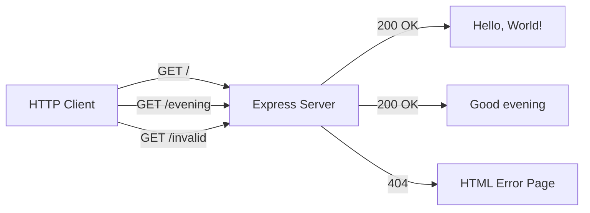
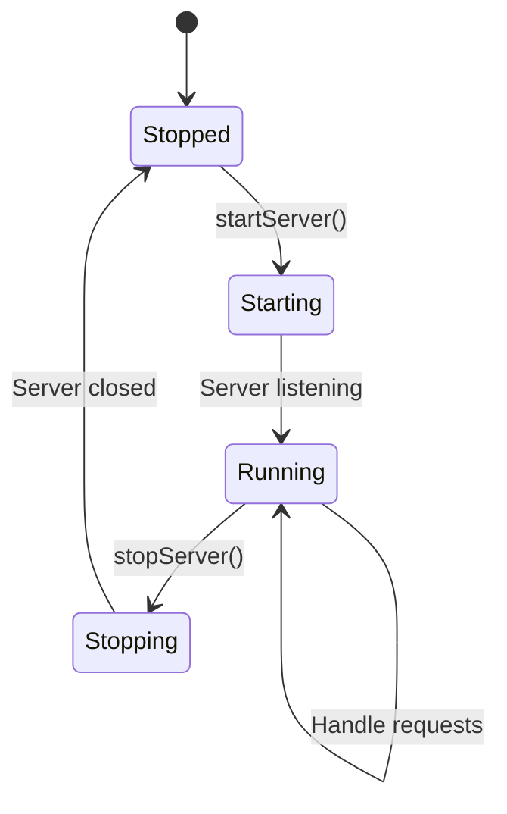
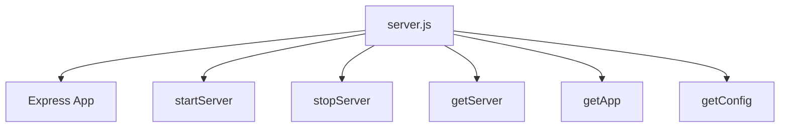

# Technical Specification

# 0. Agent Action Plan

## 0.1 Intent Clarification

Based on the provided requirements, the Blitzy platform understands that the documentation objective is to **enhance the existing Node.js Express server project with comprehensive documentation** including JSDoc comments, an enriched README, API documentation, deployment guide, and inline code explanations.

### 0.1.1 Core Documentation Objective

**Documentation Category:** Update existing documentation and Create new documentation

**Documentation Types Required:**
- JSDoc comments (inline code documentation)
- README file (project overview and user guide)
- API documentation (endpoint specifications)
- Deployment guide (deployment instructions)
- Inline code explanations (code comprehension comments)

**Specific Requirements Analysis:**

| Requirement | Interpretation | Documentation Deliverables |
|-------------|----------------|---------------------------|
| Add JSDoc comments to server.js functions | Enhance existing JSDoc annotations with more comprehensive inline code explanations | Enhanced JSDoc comments in `server.js` for all exported functions and route handlers |
| Create comprehensive README | Expand existing README.md with additional sections | Extended `README.md` with setup instructions, API documentation, deployment guide |
| Setup instructions | Document installation, configuration, and startup procedures | README section covering prerequisites, installation steps, environment setup |
| API documentation | Document all HTTP endpoints with request/response details | README section or separate API reference with endpoint specifications |
| Deployment guide | Document deployment procedures and considerations | README section or separate deployment documentation |
| Inline code explanations | Add explanatory comments within the source code | Enhanced comments in `server.js` explaining code logic and decisions |

**Implicit Documentation Needs:**
- Architecture overview explaining the Express.js server structure
- Testing documentation for the comprehensive test suite (79 tests)
- Configuration documentation for server settings (hostname, port)
- Troubleshooting section for common issues
- Module export documentation for programmatic usage

### 0.1.2 Special Instructions and Constraints

**Architectural Requirements:**
- Maintain consistency with existing JSDoc style already present in `server.js`
- Follow the existing documentation patterns in `README.md`
- Preserve the tutorial-style approach appropriate for a learning project
- Ensure documentation reflects Express.js 5.x patterns

**Documentation Style Observations from Repository:**
- The existing `server.js` already contains partial JSDoc comments using `@module`, `@route`, `@param`, `@returns` tags
- The existing `README.md` follows a structured format with clear sections (Overview, Prerequisites, Installation, API Endpoints, etc.)
- The `blitzy/documentation/` folder contains detailed markdown documentation as reference

**Web Search Research Completed:**
- <cite index="1-8">JSDoc is a popular tool for generating documentation from comments in the source code of your app</cite>
- <cite index="2-17">JSDoc provides guidance on how to add JSDoc comments to CommonJS and Node.js modules</cite>
- <cite index="9-15">JSDoc is a great way to write reference documentation that is coupled with the code itself and can be consumed by users in a variety of formats, such as HTML, markdown, JSON, or in their IDE</cite>

### 0.1.3 Technical Interpretation

These documentation requirements translate to the following technical documentation strategy:

| Requirement | Technical Action | Components Affected |
|-------------|------------------|---------------------|
| JSDoc comments for server.js | Enhance existing JSDoc blocks with detailed descriptions, examples, and type information | `server.js` |
| Comprehensive README | Extend README.md with deployment guide, architecture overview, and enhanced API docs | `README.md` |
| Setup instructions | Document Node.js v18+ requirement, npm installation, and configuration | `README.md` |
| API documentation | Add detailed endpoint specifications with request/response examples and status codes | `README.md` |
| Deployment guide | Create deployment section covering local, production, and cloud deployment options | `README.md` |
| Inline code explanations | Add explanatory comments for Express.js patterns and server logic | `server.js` |

**Implementation Strategy:**
- To enhance JSDoc comments, we will extend existing JSDoc blocks in `server.js` with `@example`, `@throws`, `@see`, and `@description` tags
- To create comprehensive README, we will expand `README.md` with Architecture, Deployment Guide, Troubleshooting, and Contributing sections
- To document API endpoints, we will add detailed request/response specifications with status codes and examples
- To add deployment guide, we will create a section covering local development, production considerations, and cloud deployment
- To add inline code explanations, we will enhance comments explaining Express.js patterns, middleware flow, and design decisions

### 0.1.4 Inferred Documentation Needs

**Based on Code Analysis:**
- `server.js` contains 6 exported functions (`app`, `startServer`, `stopServer`, `getServer`, `getApp`, `getConfig`) that need comprehensive JSDoc documentation
- Route handlers (`GET /` and `GET /evening`) need enhanced endpoint documentation with response examples
- Server lifecycle functions need documentation on callback patterns and error handling

**Based on Repository Structure:**
- The project has a comprehensive test suite (`server.test.js` with 79 tests) that should be documented for contributors
- The `package.json` defines scripts (`start`, `test`) that need documentation
- The Express.js 5.x migration context should be documented for historical reference

**Based on User Journey:**
- New users need clear setup instructions (Node.js installation, npm setup)
- Developers need API endpoint documentation with curl examples
- Contributors need testing documentation and code style guidelines
- Operations teams need deployment and configuration documentation

## 0.2 Documentation Discovery and Analysis

### 0.2.1 Existing Documentation Infrastructure Assessment

**Repository Analysis Results:**

The repository analysis reveals a **partially documented Express.js tutorial project** with existing README and inline JSDoc comments, but requiring enhancement for comprehensive coverage.

| Documentation Asset | Location | Current State | Enhancement Needed |
|---------------------|----------|---------------|-------------------|
| README.md | `/README.md` | Basic project overview, installation, API endpoints | Add deployment guide, architecture, troubleshooting |
| Server JSDoc | `/server.js` | Partial JSDoc with @module, @route, @param, @returns | Enhance with @example, @throws, inline explanations |
| Test JSDoc | `/server.test.js` | Basic @module documentation | Minimal changes needed |
| Project Guide | `/blitzy/documentation/Project Guide.md` | Comprehensive project status documentation | Use as reference for style |
| Technical Specs | `/blitzy/documentation/Technical Specifications.md` | Detailed technical specifications | Use as reference for patterns |

**Documentation Framework Analysis:**
- Current documentation framework: **Markdown-based documentation** (no generator)
- Documentation generator configuration: **None configured**
- API documentation tools in use: **JSDoc inline comments** (no HTML generation)
- Diagram tools detected: **Mermaid** (used in blitzy/documentation/)
- Documentation hosting/deployment: **None** (local files only)

**Existing README.md Structure (96 lines):**
```
# Hello World Node.js Server

├── Overview
├── Prerequisites (Node.js v18+)
├── Installation (npm install)
├── Running the Server (node server.js)
├── API Endpoints
│   ├── GET /
│   └── GET /evening
├── Server Configuration (table)
├── Testing (npm test)
│   └── Test Coverage
├── Dependencies (production + dev)
└── License (MIT)
```

**Existing server.js JSDoc Coverage:**
- Module-level documentation: ✅ Present (lines 1-15)
- Route handler `GET /`: ✅ Present with @route, @returns (lines 26-35)
- Route handler `GET /evening`: ✅ Present with @route, @returns (lines 37-46)
- `startServer()`: ✅ Present with @param, @returns (lines 54-68)
- `stopServer()`: ✅ Present with @param (lines 70-86)
- `getServer()`: ✅ Present with @returns (lines 88-95)
- `getApp()`: ✅ Present with @returns (lines 97-104)
- `getConfig()`: ✅ Present with @returns (lines 106-115)

### 0.2.2 Repository Code Analysis for Documentation

**Search Patterns Applied:**

| Search Pattern | Results | Relevance |
|----------------|---------|-----------|
| `*.js` (JavaScript source) | `server.js`, `server.test.js`, `server - Copy.js` | Primary documentation targets |
| `*.md` (Markdown docs) | `README.md`, `blitzy/documentation/*.md` | Existing documentation |
| `package.json` | Present | Dependency and script documentation |
| Configuration files | `.gitignore` only | Minimal configuration |

**Key Source Files Examined:**

| File | Lines | Purpose | Documentation Status |
|------|-------|---------|---------------------|
| `server.js` | 131 | Main Express server implementation | Partial JSDoc - needs enhancement |
| `server.test.js` | 661 | Comprehensive Jest test suite | Basic JSDoc - adequate |
| `package.json` | 20 | npm manifest and scripts | Needs README documentation |

**Modules Requiring Enhanced Documentation:**

- **server.js Module Exports:**
  - `app` - Express application instance
  - `startServer(callback)` - Server lifecycle start
  - `stopServer(callback)` - Server lifecycle stop
  - `getServer()` - Server instance accessor
  - `getApp()` - Express app accessor
  - `getConfig()` - Configuration accessor

- **API Routes:**
  - `GET /` - Root endpoint returning "Hello, World!\n"
  - `GET /evening` - Evening greeting endpoint returning "Good evening"

### 0.2.3 Web Search Research Conducted

**JSDoc Best Practices for Express.js:**
- <cite index="1-8">JSDoc is a popular tool for generating documentation from comments in the source code</cite>
- <cite index="2-17">JSDoc provides documentation for CommonJS and Node.js modules</cite>
- <cite index="9-17">One benefit about using JSDoc is that writing documentation in the comments happens at the same time as writing the code</cite>

**Documentation Structure Conventions:**
- Standard README sections: Overview, Installation, Usage, API Reference, Configuration, Testing, Contributing, License
- Express.js API documentation should include: method, path, description, request parameters, response format, status codes, examples

**Recommended JSDoc Tags for Express.js:**
- `@module` - Module identification
- `@function` - Function documentation
- `@param` - Parameter documentation with types
- `@returns` - Return value documentation
- `@example` - Usage examples
- `@throws` - Error conditions
- `@see` - Cross-references
- `@route` - Express route documentation (custom tag)
- `@description` - Detailed descriptions

## 0.3 Documentation Scope Analysis

### 0.3.1 Code-to-Documentation Mapping

**Modules Requiring Documentation:**

**Module: server.js (Primary Target)**

| Element | Type | Current Documentation | Documentation Needed |
|---------|------|----------------------|---------------------|
| Module Header | @module | Present (lines 1-15) | Enhance with @description, @version, @author |
| `app` | Export | No JSDoc | Add @type, @description |
| `hostname` | Constant | Inline comment only | Add @constant, @type |
| `port` | Constant | Inline comment only | Add @constant, @type |
| `GET /` route | Express Route | @route, @returns (lines 26-35) | Add @example with curl command |
| `GET /evening` route | Express Route | @route, @returns (lines 37-46) | Add @example with curl command |
| `server` variable | Variable | @type (line 48-52) | Adequate - no changes needed |
| `startServer()` | Function | @param, @returns (lines 54-68) | Add @example, @throws, inline explanation |
| `stopServer()` | Function | @param (lines 70-86) | Add @example, @throws, inline explanation |
| `getServer()` | Function | @returns (lines 88-95) | Add @example, inline explanation |
| `getApp()` | Function | @returns (lines 97-104) | Add @example, inline explanation |
| `getConfig()` | Function | @returns (lines 106-115) | Add @example, inline explanation |
| Module guard | Code pattern | Comment (line 117) | Enhance explanation of pattern |
| Exports block | module.exports | Comment (line 122) | Add detailed export explanation |

**API Endpoints Requiring Documentation:**

| Endpoint | Method | Response | Documentation Status | Enhancements Needed |
|----------|--------|----------|---------------------|---------------------|
| `/` | GET | `Hello, World!\n` | Basic in README | Add status codes, headers, content-type |
| `/evening` | GET | `Good evening` | Basic in README | Add status codes, headers, content-type |
| `/*` (catch-all) | * | 404 HTML error | Mentioned in README | Document error response format |

**Configuration Options Requiring Documentation:**

| Config Option | Current Value | Documented In | Enhancement Needed |
|---------------|---------------|---------------|-------------------|
| `hostname` | `127.0.0.1` | README table, server.js comment | Add to configuration section with explanation |
| `port` | `3000` | README table, server.js comment | Add to configuration section with explanation |
| Express version | `^5.2.1` | README, package.json | Document Node.js v18+ requirement |

### 0.3.2 Documentation Gap Analysis

**Given the requirements and repository analysis, documentation gaps include:**

**JSDoc Gaps in server.js:**
- Missing `@example` tags on all functions
- Missing `@throws` documentation for error conditions
- Missing `@see` cross-references between related functions
- Missing inline code explanations for Express.js patterns
- Missing callback parameter documentation details

**README.md Gaps:**
- No deployment guide section
- No architecture/design overview
- No troubleshooting section
- No contributing guidelines
- No detailed error response documentation
- No environment configuration documentation
- No programmatic usage examples

**Missing Documentation Files:**
- No dedicated API reference document (could be inline in README)
- No CONTRIBUTING.md file
- No DEPLOYMENT.md file
- No architecture diagrams

### 0.3.3 Documentation Enhancement Priorities

**Priority 1 - Critical (User-Requested):**
- Enhanced JSDoc comments in server.js with examples and explanations
- Comprehensive README with deployment guide
- API documentation with full request/response specifications

**Priority 2 - Important (Inferred):**
- Inline code explanations for Express.js patterns
- Configuration documentation
- Error handling documentation

**Priority 3 - Nice-to-Have (Best Practice):**
- Contributing guidelines
- Troubleshooting section
- Architecture overview diagram

## 0.4 Documentation Implementation Design

### 0.4.1 Documentation Structure Planning

**Target Documentation Hierarchy:**

```
Project Root/
├── README.md (comprehensive project documentation)
│   ├── Overview and Introduction
│   ├── Features
│   ├── Prerequisites
│   ├── Installation
│   ├── Quick Start
│   ├── API Reference
│   │   ├── GET / (Hello World endpoint)
│   │   ├── GET /evening (Evening greeting endpoint)
│   │   └── Error Responses
│   ├── Server Configuration
│   ├── Programmatic Usage
│   │   ├── Starting the Server
│   │   ├── Stopping the Server
│   │   └── Accessing Server Components
│   ├── Testing
│   │   ├── Running Tests
│   │   └── Test Coverage
│   ├── Deployment Guide
│   │   ├── Local Development
│   │   ├── Production Deployment
│   │   └── Docker Deployment (optional)
│   ├── Troubleshooting
│   ├── Contributing
│   ├── Dependencies
│   ├── Architecture Overview
│   └── License
├── server.js (enhanced JSDoc + inline explanations)
│   ├── Module documentation block
│   ├── Constant declarations with JSDoc
│   ├── Route handlers with examples
│   ├── Server lifecycle functions with examples
│   ├── Accessor functions with examples
│   └── Export block with explanation
└── server.test.js (existing documentation adequate)
```

### 0.4.2 Content Generation Strategy

**Information Extraction Approach:**

- Extract API signatures from `server.js` route handlers and exported functions
- Generate examples by referencing test cases in `server.test.js`
- Create configuration documentation from server constants and `package.json`
- Use existing `blitzy/documentation/Project Guide.md` as style reference

**JSDoc Enhancement Strategy:**

```javascript
// Example of enhanced JSDoc for startServer function
/**
 * Starts the Express server on the configured hostname and port.
 * 
 * This function initializes the HTTP listener and binds the Express
 * application to the specified network interface. The server will
 * accept incoming HTTP requests once started.
 *
 * @function startServer
 * @param {Function} [callback] - Optional callback invoked when server is ready
 * @param {http.Server} callback.server - The started server instance
 * @returns {http.Server} The HTTP server instance
 * @throws {Error} If port is already in use (EADDRINUSE)
 * @example
 * // Start server with callback
 * startServer((server) => {
 *   console.log('Server ready!');
 * });
 * @see {@link stopServer} for graceful shutdown
 * @see {@link getServer} for accessing the running server
 */
```

**README Enhancement Strategy:**

| Section | Content Source | Format |
|---------|---------------|--------|
| Overview | Existing README + project description | Prose paragraph |
| API Reference | Route handlers + test examples | Tables + code blocks |
| Deployment Guide | New content based on Express.js patterns | Step-by-step instructions |
| Programmatic Usage | Exported functions from server.js | Code examples |
| Troubleshooting | Common issues from test coverage | Q&A format |

### 0.4.3 Documentation Standards

**Markdown Formatting Requirements:**
- Use `#` for main title, `##` for sections, `###` for subsections
- Use fenced code blocks with language identifiers (```javascript, ```bash)
- Use tables for structured data (endpoints, configuration, dependencies)
- Use inline code backticks for file names, functions, and code references

**JSDoc Formatting Requirements:**
- Multi-line comment blocks with `/** ... */`
- Tags on separate lines with proper indentation
- Include `@example` blocks for usage demonstration
- Use `@see` for cross-referencing related functions
- Document return types with `@returns {Type}` syntax

**Code Example Requirements:**
- All curl examples must be copy-paste ready
- JavaScript examples must be syntactically valid
- Include expected output in comments where appropriate

**Source Citation Format:**
- Reference source files as: `Source: /path/to/file.js:LineNumber`
- Use inline comments for explanations: `// Explanation of pattern`

### 0.4.4 Diagram and Visual Strategy

**Mermaid Diagrams to Create:**

**1. Request Flow Diagram (for README):**


**2. Server Lifecycle Diagram (for README):**


**3. Module Export Diagram (for inline documentation):**


## 0.5 Documentation File Transformation Mapping

### 0.5.1 File-by-File Documentation Plan

**Documentation Transformation Modes:**
- **CREATE** - Create a new documentation file
- **UPDATE** - Update an existing documentation file  
- **DELETE** - Remove an obsolete documentation file
- **REFERENCE** - Use as an example for documentation style and structure

| Target Documentation File | Transformation | Source Code/Docs | Content/Changes |
|---------------------------|----------------|------------------|-----------------|
| `server.js` | UPDATE | `server.js`, `server.test.js` | Enhance JSDoc comments with @example, @throws, @see tags; add inline code explanations for Express.js patterns, module guard, and exports |
| `README.md` | UPDATE | `README.md`, `server.js`, `package.json` | Expand with Architecture Overview, Deployment Guide, Programmatic Usage, Troubleshooting, Contributing sections; enhance API documentation with status codes and headers |
| `blitzy/documentation/Project Guide.md` | REFERENCE | N/A | Use as style reference for documentation formatting and structure |
| `blitzy/documentation/Technical Specifications.md` | REFERENCE | N/A | Use as reference for technical documentation patterns |

### 0.5.2 server.js Enhancement Detail

**File:** `server.js`  
**Type:** Source Code with JSDoc  
**Transformation:** UPDATE  
**Current Lines:** 131  
**Estimated Lines After:** ~180-200

**JSDoc Enhancements Required:**

| Code Element | Line(s) | Current Tags | Tags to Add | Inline Explanation |
|--------------|---------|--------------|-------------|-------------------|
| Module block | 1-15 | @module | @description, @version, @author, @license | Enhanced module overview |
| `hostname` constant | 23 | comment | @constant, @type | Explain localhost binding |
| `port` constant | 24 | comment | @constant, @type | Explain port selection |
| `GET /` route | 26-35 | @route, @returns | @example, @description | Explain Express routing pattern |
| `GET /evening` route | 37-46 | @route, @returns | @example, @description | Explain route handler pattern |
| `server` variable | 48-52 | @type | - | Explain null initialization pattern |
| `startServer()` | 54-68 | @param, @returns | @example, @throws, @see, @description | Explain callback pattern, error handling |
| `stopServer()` | 70-86 | @param | @example, @throws, @see, @description | Explain graceful shutdown |
| `getServer()` | 88-95 | @returns | @example, @description | Explain accessor pattern |
| `getApp()` | 97-104 | @returns | @example, @description | Explain app instance access |
| `getConfig()` | 106-115 | @returns | @example, @description | Explain configuration retrieval |
| Module guard | 117-119 | comment | - | Detailed explanation of require.main pattern |
| Exports block | 122-130 | comment | - | Explain CommonJS exports |

**Inline Code Explanation Additions:**

```javascript
// Line ~17: After require('express')
// Express.js is imported as a CommonJS module. Express 5.x is used,
// which requires Node.js v18+ and includes built-in Promise support.

// Line ~20: After app creation
// Create the Express application instance. This is the central object
// that defines routes, middleware, and handles incoming HTTP requests.

// Line ~23-24: Configuration constants
// Server binds to localhost (127.0.0.1) for security - only local
// connections are accepted. Port 3000 is a common development port.

// Line ~33-34: Route handler
// res.send() automatically sets Content-Type and Content-Length headers.
// The trailing newline in "Hello, World!\n" preserves original behavior.

// Line ~61-66: Server listen
// app.listen() returns an http.Server instance. The callback fires
// once the server is bound and ready to accept connections.

// Line ~76-85: Graceful shutdown
// server.close() stops accepting new connections and waits for
// existing connections to complete before invoking the callback.

// Line ~117-119: Module guard pattern
// require.main === module checks if this file was run directly (not imported).
// This allows the module to be used both as a standalone server and as
// a library that can be imported for testing.
```

### 0.5.3 README.md Enhancement Detail

**File:** `README.md`  
**Type:** Markdown Documentation  
**Transformation:** UPDATE  
**Current Lines:** 96  
**Estimated Lines After:** ~250-300

**Section-by-Section Enhancement Plan:**

| Section | Current State | Action | New Content |
|---------|---------------|--------|-------------|
| Title & Badges | Title only | Enhance | Add badges for Node.js version, license, tests |
| Overview | 2 paragraphs | Expand | Add feature highlights, Express.js 5.x mention |
| Features | Not present | CREATE | List of server capabilities |
| Prerequisites | Basic | Enhance | Add version requirements, OS compatibility |
| Installation | Basic | Enhance | Add troubleshooting, verification steps |
| Quick Start | Not present | CREATE | Minimal steps to run server |
| API Endpoints | Basic | Expand | Add status codes, headers, content-type, error responses |
| Server Configuration | Table only | Expand | Add configuration explanation, customization |
| Programmatic Usage | Not present | CREATE | Document exported functions with examples |
| Testing | Basic | Enhance | Add test categories, coverage details |
| Deployment Guide | Not present | CREATE | Local, production, Docker sections |
| Troubleshooting | Not present | CREATE | Common issues and solutions |
| Contributing | Not present | CREATE | Basic contribution guidelines |
| Architecture | Not present | CREATE | Overview diagram and explanation |
| Dependencies | Basic | Adequate | No changes needed |
| License | Present | Adequate | No changes needed |

**New README Sections Content Outline:**

```
## Features (NEW)

- Express.js 5.x powered HTTP server
- Two greeting endpoints (/ and /evening)
- Programmatic server control (start/stop)
- Comprehensive test suite (79 tests)
- Zero security vulnerabilities

#### Quick Start (NEW)

npm install && node server.js
curl http://127.0.0.1:3000/

#### Programmatic Usage (NEW)

#### Starting the Server

#### Stopping the Server

#### Accessing Configuration

#### Deployment Guide (NEW)

#### Local Development

#### Production Considerations

#### Environment Variables (future)

#### Troubleshooting (NEW)

#### Port Already in Use

#### Connection Refused

#### Module Not Found

#### Architecture Overview (NEW)

[Mermaid diagram of request flow]

#### Contributing (NEW)

#### Code Style

#### Testing Requirements

#### Pull Request Process

```

### 0.5.4 Cross-Documentation Dependencies

**Shared Content Elements:**
- Server configuration (hostname, port) referenced in both README and server.js
- API endpoint specifications in README match route JSDoc in server.js
- Test command (`npm test`) referenced in README and package.json

**Navigation Links Required:**
- README API section should reference source code location
- server.js JSDoc should reference README for full documentation
- Test documentation should link to test file

**Table of Contents Update:**
- README requires updated table of contents reflecting new sections

**Consistency Requirements:**
- Version numbers must match between README and package.json
- Configuration values must match between README and server.js
- Example commands must be tested and working

## 0.6 Dependency Inventory

### 0.6.1 Documentation Dependencies

**Current Project Dependencies (from package.json):**

| Registry | Package Name | Version | Purpose |
|----------|--------------|---------|---------|
| npm | express | ^5.2.1 | Production - Express.js web framework |
| npm | jest | ^29.7.0 | Development - JavaScript testing framework |
| npm | supertest | ^7.1.0 | Development - HTTP assertions for testing |

**No Additional Documentation Tools Required:**

This documentation task focuses on:
- Inline JSDoc comments (built-in JavaScript documentation)
- Markdown documentation (README.md)
- Mermaid diagrams (rendered by GitHub/GitLab natively)

No additional npm packages are required for the documentation enhancements.

**Optional Documentation Generation Tools (Not Required):**

If future HTML documentation generation is desired, these tools could be added:

| Registry | Package Name | Version | Purpose |
|----------|--------------|---------|---------|
| npm | jsdoc | ^4.0.2 | Generate HTML docs from JSDoc comments |
| npm | jsdoc-to-markdown | ^8.0.0 | Generate markdown from JSDoc comments |
| npm | docdash | ^2.0.2 | Modern JSDoc template |

### 0.6.2 Runtime Requirements

**Node.js Runtime:**

| Requirement | Value | Source |
|-------------|-------|--------|
| Minimum Version | v18.0.0 | Express.js 5.x requirement |
| Recommended Version | v20.x LTS | Current LTS version |
| Verified Version | v20.20.0 | Tested in development environment |

**npm Package Manager:**

| Requirement | Value | Source |
|-------------|-------|--------|
| Minimum Version | v7.0.0 | npm workspaces support |
| Recommended Version | v10.x+ | Current stable |
| Verified Version | v11.1.0 | Tested in development environment |

### 0.6.3 Documentation Reference Updates

**Documentation Files Requiring Link Updates:**

| File | Section | Current Link | Action |
|------|---------|--------------|--------|
| README.md | API Endpoints | None | Add links to source code lines |
| README.md | Testing | None | Add link to server.test.js |
| server.js | JSDoc @see | None | Add cross-references between functions |

**Internal Documentation Links to Add:**

```
<!-- In README.md -->
See [server.js](./server.js) for full source code.
See [server.test.js](./server.test.js) for test examples.

<!-- In server.js JSDoc -->
@see {@link stopServer} for graceful shutdown
@see {@link getConfig} for server configuration
@see README.md for full API documentation
```

### 0.6.4 Version Compatibility Matrix

| Component | Minimum | Maximum | Tested |
|-----------|---------|---------|--------|
| Node.js | 18.0.0 | 22.x | 20.20.0 |
| npm | 7.0.0 | 11.x | 11.1.0 |
| Express.js | 5.0.0 | 5.x | 5.2.1 |
| Jest | 29.0.0 | 30.x | 29.7.0 |
| Supertest | 7.0.0 | 7.x | 7.1.0 |

## 0.7 Coverage and Quality Targets

### 0.7.1 Documentation Coverage Metrics

**Current Coverage Analysis:**

| Category | Items | Documented | Coverage | Target |
|----------|-------|------------|----------|--------|
| Public Functions | 6 | 6 | 100% | 100% (with enhancements) |
| Route Handlers | 2 | 2 | 100% | 100% (with examples) |
| Configuration Options | 2 | 2 | 100% | 100% |
| Module Exports | 6 | 1 | 17% | 100% |
| README Sections | 11 | 11 | 100% | 100% (+ 6 new sections) |
| Usage Examples | 4 | 0 | 0% | 100% |
| Error Documentation | 3 | 1 | 33% | 100% |

**JSDoc Coverage Targets:**

| Function | Current Tags | Target Tags | Status |
|----------|--------------|-------------|--------|
| startServer | @param, @returns | @param, @returns, @example, @throws, @see, @description | Enhancement needed |
| stopServer | @param | @param, @returns, @example, @throws, @see, @description | Enhancement needed |
| getServer | @returns | @returns, @example, @description | Enhancement needed |
| getApp | @returns | @returns, @example, @description | Enhancement needed |
| getConfig | @returns | @returns, @example, @description | Enhancement needed |
| GET / | @route, @returns | @route, @returns, @example, @description | Enhancement needed |
| GET /evening | @route, @returns | @route, @returns, @example, @description | Enhancement needed |

**README Coverage Targets:**

| Section | Current | Target | Priority |
|---------|---------|--------|----------|
| Overview | Present | Enhanced | Medium |
| Features | Missing | Present | High |
| Prerequisites | Present | Adequate | Low |
| Installation | Present | Adequate | Low |
| Quick Start | Missing | Present | High |
| API Endpoints | Present | Enhanced with details | High |
| Server Configuration | Present | Enhanced | Medium |
| Programmatic Usage | Missing | Present | High |
| Testing | Present | Adequate | Low |
| Deployment Guide | Missing | Present | High |
| Troubleshooting | Missing | Present | High |
| Contributing | Missing | Present | Medium |
| Architecture | Missing | Present | Medium |
| Dependencies | Present | Adequate | Low |
| License | Present | Adequate | Low |

### 0.7.2 Documentation Quality Criteria

**Completeness Requirements:**

- ✅ All public functions have JSDoc comments with @description, @param, @returns
- ✅ All exported functions include @example usage blocks
- ✅ All route handlers document request and response formats
- ✅ All configuration options are documented with defaults and valid values
- ✅ README includes all major sections (setup, usage, API, deployment)
- ✅ Error conditions documented with @throws where applicable

**Accuracy Validation:**

| Validation | Method | Status |
|------------|--------|--------|
| Code examples syntactically valid | Manual review | Required |
| curl commands tested | Execution test | Required |
| API responses match documentation | Test suite verification | Pass (79/79) |
| Configuration values accurate | Code inspection | Verified |
| Version numbers correct | package.json check | Verified |

**Clarity Standards:**

- Technical accuracy with accessible language suitable for tutorial project
- Progressive disclosure: simple usage first, then advanced options
- Consistent terminology throughout (e.g., "server" vs "app" vs "application")
- Clear section headings with logical organization
- Code examples include comments explaining key lines

**Maintainability Requirements:**

- Source citations for traceability (e.g., `Source: server.js:60`)
- JSDoc @see references for cross-linking related functions
- Clear ownership via @author tag
- Version tracking via @version tag
- Template-based structure for consistency

### 0.7.3 Example and Diagram Requirements

**Minimum Examples Per Element:**

| Element Type | Required Examples | Format |
|--------------|-------------------|--------|
| Route handler | 1 curl command | bash code block |
| Lifecycle function | 1 JavaScript snippet | js code block |
| Accessor function | 1 JavaScript snippet | js code block |
| API endpoint (README) | 1 request + response | bash + text blocks |

**Diagram Requirements:**

| Diagram | Type | Location | Purpose |
|---------|------|----------|---------|
| Request Flow | Flowchart | README.md | Show HTTP request handling |
| Server Lifecycle | State diagram | README.md | Show start/stop states |
| Module Exports | Graph | Optional | Show export relationships |

**Code Example Testing:**

| Example Type | Validation Method |
|--------------|-------------------|
| curl commands | Manual execution against running server |
| JavaScript snippets | Syntax validation (parseable) |
| npm commands | Execution in test environment |

### 0.7.4 Quality Validation Checklist

**Pre-Completion Checklist:**

- [ ] All JSDoc blocks use consistent formatting
- [ ] All @param tags include type and description
- [ ] All @returns tags include type and description
- [ ] All @example blocks are syntactically valid
- [ ] All curl examples include full URL
- [ ] All code blocks specify language for syntax highlighting
- [ ] README table of contents matches sections
- [ ] All internal links are valid
- [ ] No broken markdown formatting
- [ ] Mermaid diagrams render correctly
- [ ] Consistent capitalization in headings
- [ ] No orphaned documentation (unreferenced sections)

## 0.8 Scope Boundaries

### 0.8.1 Exhaustively In Scope

**Documentation File Modifications:**

| File Pattern | Action | Description |
|--------------|--------|-------------|
| `server.js` | UPDATE | Enhance JSDoc comments and add inline code explanations |
| `README.md` | UPDATE | Expand with deployment guide, programmatic usage, troubleshooting, architecture |

**JSDoc Enhancements (server.js):**

| Element | Enhancement |
|---------|-------------|
| Module header (lines 1-15) | Add @description, @version, @author, @license |
| Configuration constants | Add @constant, @type tags with explanations |
| `GET /` route handler | Add @example with curl command |
| `GET /evening` route handler | Add @example with curl command |
| `startServer()` function | Add @example, @throws, @see, enhanced @description |
| `stopServer()` function | Add @example, @throws, @see, enhanced @description |
| `getServer()` function | Add @example, enhanced @description |
| `getApp()` function | Add @example, enhanced @description |
| `getConfig()` function | Add @example, enhanced @description |
| Module guard (require.main) | Add detailed inline explanation |
| Exports block | Add explanatory comments |

**README Enhancements:**

| Section | Action | Content |
|---------|--------|---------|
| Overview | Enhance | Expand with feature highlights |
| Features | CREATE | List of server capabilities |
| Quick Start | CREATE | Minimal steps to run server |
| API Endpoints | Enhance | Add status codes, headers, content-type, error responses |
| Server Configuration | Enhance | Add configuration explanation |
| Programmatic Usage | CREATE | Document exported functions with examples |
| Deployment Guide | CREATE | Local, production considerations |
| Troubleshooting | CREATE | Common issues and solutions |
| Contributing | CREATE | Basic contribution guidelines |
| Architecture Overview | CREATE | Request flow diagram and explanation |

**Inline Code Explanations (server.js):**

| Location | Explanation Topic |
|----------|------------------|
| After `require('express')` | Express.js module import and version |
| After `express()` call | Express application instance creation |
| Configuration constants | Localhost binding and port selection rationale |
| Route handler bodies | Express res.send() behavior |
| startServer callback | Server binding and readiness |
| stopServer logic | Graceful shutdown pattern |
| Module guard | require.main === module pattern |
| Exports block | CommonJS export pattern |

### 0.8.2 Explicitly Out of Scope

**Source Code Modifications (NOT ALLOWED):**

| File | Restriction |
|------|-------------|
| `server.js` | No functional code changes - ONLY documentation and comments |
| `server.test.js` | No modifications required |
| `package.json` | No modifications required |
| `package-lock.json` | No modifications |

**New File Creation (NOT IN SCOPE):**

| File | Reason |
|------|--------|
| `CONTRIBUTING.md` | Not explicitly requested; content goes in README |
| `DEPLOYMENT.md` | Not explicitly requested; content goes in README |
| `API.md` | Not explicitly requested; content goes in README |
| `docs/**` folder | No documentation folder structure requested |
| `jsdoc.json` | JSDoc HTML generation not requested |

**Documentation Areas NOT In Scope:**

| Area | Reason |
|------|--------|
| Test file documentation enhancement | server.test.js already has adequate documentation |
| Java file documentation (LoginTest.java) | Unrelated to server project |
| CSV data file documentation (industry.csv) | Unrelated to server project |
| Copy/backup files documentation | Not primary files |
| blitzy/documentation updates | Reference files only |

**Feature Additions NOT In Scope:**

| Feature | Reason |
|---------|--------|
| Add Swagger UI integration | Not requested |
| Add JSDoc HTML generation | Not requested |
| Add environment variable support | Source code change |
| Add new endpoints | Source code change |
| Add middleware | Source code change |
| Add error handling middleware | Source code change |

### 0.8.3 Scope Validation Matrix

| Requirement | In Scope? | Deliverable |
|-------------|-----------|-------------|
| Add JSDoc comments to server.js functions | ✅ YES | Enhanced JSDoc in server.js |
| Create comprehensive README | ✅ YES | Updated README.md |
| Setup instructions | ✅ YES | README Installation section |
| API documentation | ✅ YES | README API Endpoints section |
| Deployment guide | ✅ YES | README Deployment Guide section |
| Inline code explanations | ✅ YES | Comments in server.js |
| Source code functional changes | ❌ NO | N/A |
| New documentation files | ❌ NO | N/A |
| Test file modifications | ❌ NO | N/A |
| JSDoc HTML generation setup | ❌ NO | N/A |

## 0.9 Execution Parameters

### 0.9.1 Documentation-Specific Instructions

**Documentation Build/Preview Commands:**

| Command | Purpose | Notes |
|---------|---------|-------|
| `npm start` | Start server for API testing | Verify curl examples work |
| `npm test` | Run test suite | Verify test documentation accuracy |
| `node server.js` | Alternative server start | Direct execution |

**Documentation Validation Commands:**

```bash
# Verify server starts correctly (for documentation accuracy)

node server.js &
SERVER_PID=$!
sleep 2
curl -s http://127.0.0.1:3000/
curl -s http://127.0.0.1:3000/evening
kill $SERVER_PID
```

```bash
# Run tests to verify documentation matches behavior

npm test
```

**Default Documentation Formats:**

| Format | Usage |
|--------|-------|
| Markdown | README.md documentation |
| JSDoc | server.js inline documentation |
| Mermaid | Diagrams in README.md |
| Bash | Command examples |
| JavaScript | Code examples |

### 0.9.2 Style Guide Requirements

**JSDoc Style Guide:**

```javascript
/**
 * Brief one-line summary of the function.
 * 
 * Detailed multi-line description explaining the function's
 * purpose, behavior, and any important considerations.
 *
 * @param {Type} paramName - Description of parameter
 * @returns {Type} Description of return value
 * @throws {ErrorType} Description of when error is thrown
 * @example
 * const result = functionName(arg);
 * @see relatedFunction for related functionality
 */
```

**Markdown Style Guide:**

- Use `# Main Title` (H1) - one per document
- Use `## Section` (H2) - for major sections
- Use `### Subsection` (H3) - for subsections
- Use `**Bold text**` for emphasis
- Use backticks for `inline code` references
- Use fenced code blocks with language specifiers

**Inline Comment Style Guide:**

```javascript
// Single-line explanation for simple concepts

// Multi-line explanation for complex concepts.
// Continues on next line with additional context
// about the code pattern or decision.
```

### 0.9.3 Citation Requirements

**Source Code Citations:**

All technical documentation must cite source files:

- `Source: server.js:60-68`
- `Source: package.json (dependencies section)`
- `Source: server.test.js:26-29`

**External Reference Citations:**

- `Reference: Express.js 5.x Documentation`
- `Reference: Node.js HTTP Module Documentation`

### 0.9.4 Environment Configuration

**Verified Development Environment:**

| Component | Version | Status |
|-----------|---------|--------|
| Node.js | v20.20.0 | ✅ Verified |
| npm | v11.1.0 | ✅ Verified |
| Express.js | 5.2.1 | ✅ Installed |
| Jest | 29.7.0 | ✅ Installed |
| Supertest | 7.1.0 | ✅ Installed |

**Test Execution Results:**

- Test Suites: 1 passed, 1 total
- Tests: 79 passed, 79 total
- Snapshots: 0 total
- Time: ~1.6s

All 79 tests pass, confirming documentation can accurately reflect server behavior.

## 0.10 Rules for Documentation

### 0.10.1 User-Specified Documentation Rules

Based on the user's requirements, the following documentation rules apply:

**Rule 1: JSDoc Comments for server.js Functions**
- All functions in `server.js` must have JSDoc comments
- JSDoc comments must include `@param`, `@returns`, and `@example` tags where applicable
- Existing JSDoc structure must be preserved and enhanced

**Rule 2: Comprehensive README Requirements**
- README must include setup instructions
- README must include API documentation
- README must include deployment guide
- README must be comprehensive (covering all aspects of the project)

**Rule 3: Inline Code Explanations**
- Source code must include inline comments explaining code logic
- Comments should explain Express.js patterns and design decisions
- Comments should be educational, appropriate for a tutorial project

### 0.10.2 Inferred Documentation Rules

**Consistency Rules:**
- Follow existing JSDoc style in server.js (multi-line blocks, tag order)
- Follow existing README structure (section order, formatting)
- Use consistent terminology throughout documentation

**Accuracy Rules:**
- All code examples must be syntactically valid
- All curl commands must be executable
- All version numbers must match package.json
- All API responses must match actual server behavior

**Completeness Rules:**
- Every public function must be documented
- Every API endpoint must be documented
- Every configuration option must be documented

**Format Rules:**
- Use Markdown for README documentation
- Use JSDoc format for inline code documentation
- Use Mermaid for diagrams
- Use fenced code blocks with language specifiers

### 0.10.3 Documentation Constraints

**DO:**
- ✅ Enhance existing JSDoc comments with additional tags and examples
- ✅ Expand README.md with new sections (deployment, troubleshooting)
- ✅ Add inline explanatory comments in server.js
- ✅ Maintain consistency with existing documentation style
- ✅ Keep documentation appropriate for tutorial/learning context

**DO NOT:**
- ❌ Modify any functional source code
- ❌ Create new documentation files (keep everything in README.md and server.js)
- ❌ Add npm dependencies for documentation generation
- ❌ Change the project structure
- ❌ Remove existing documentation

## 0.11 References

### 0.11.1 Repository Files Analyzed

**Source Code Files:**

| File Path | Lines | Purpose | Analysis Conducted |
|-----------|-------|---------|-------------------|
| `/server.js` | 131 | Main Express server implementation | Full JSDoc analysis, function inventory, code structure review |
| `/server.test.js` | 661 | Jest test suite with 79 tests | Test coverage review, example extraction |
| `/server - Copy.js` | ~15 | Backup of original http module server | Reference only, not in scope |

**Configuration Files:**

| File Path | Purpose | Analysis Conducted |
|-----------|---------|-------------------|
| `/package.json` | npm manifest, dependencies, scripts | Version verification, dependency analysis |
| `/package-lock.json` | Dependency lock file | Version verification |
| `/.gitignore` | Git ignore patterns | Minimal, not relevant to documentation |

**Documentation Files:**

| File Path | Lines | Purpose | Analysis Conducted |
|-----------|-------|---------|-------------------|
| `/README.md` | 96 | Project README | Structure analysis, gap identification |
| `/blitzy/documentation/Project Guide.md` | ~260 | Project status and guide | Style reference |
| `/blitzy/documentation/Technical Specifications.md` | ~100+ | Technical specifications | Pattern reference |

**Other Files (Not Analyzed - Out of Scope):**

| File Path | Reason |
|-----------|--------|
| `/LoginTest.java` | Unrelated Java test file |
| `/LoginTest - Copy.java` | Unrelated Java test file |
| `/industry.csv` | Unrelated data file |
| `/industry - Copy.csv` | Unrelated data file |
| `/test.py.txt` | Empty placeholder |
| `/test.py - Copy.txt` | Empty placeholder |
| `/test.txt.txt` | Empty placeholder |

### 0.11.2 Folders Searched

| Folder Path | Children Found | Relevance |
|-------------|----------------|-----------|
| `/` (root) | 14 files, 1 folder | Primary project location |
| `/blitzy/` | 1 folder | Documentation container |
| `/blitzy/documentation/` | 2 files | Reference documentation |

### 0.11.3 Web Search Research Conducted

**Search Query:** "JSDoc best practices Express.js server documentation 2024"

**Key Sources Referenced:**

| Source | Key Finding | Citation Index |
|--------|-------------|----------------|
| dev.to (JSDoc + Swagger) | JSDoc is a popular tool for generating documentation from source code | 1-8 |
| jsdoc.app | JSDoc provides guidance for CommonJS and Node.js modules | 2-17 |
| deno.com/blog | JSDoc reference documentation coupled with code can be consumed in HTML, markdown, JSON, or IDE | 9-15, 9-17 |
| LogRocket Blog | Swagger and JSDoc integration patterns for Express APIs | 6-21 to 6-27 |
| GitHub BRIKEV/express-jsdoc-swagger | Express-specific JSDoc patterns for OpenAPI generation | 4-3 to 4-4 |

### 0.11.4 User Attachments

**No attachments provided by user.**

### 0.11.5 Figma URLs

**No Figma URLs provided by user.**

### 0.11.6 External Documentation References

| Reference | URL | Purpose |
|-----------|-----|---------|
| Express.js 5.x Documentation | https://expressjs.com/ | Framework reference |
| JSDoc Official Documentation | https://jsdoc.app/ | JSDoc tag reference |
| Node.js HTTP Module | https://nodejs.org/api/http.html | Server module reference |
| Jest Documentation | https://jestjs.io/docs/ | Testing framework reference |
| Supertest Documentation | https://github.com/ladjs/supertest | HTTP testing reference |

### 0.11.7 Version References

| Component | Version | Source |
|-----------|---------|--------|
| Node.js | v20.20.0 | Runtime verification |
| npm | v11.1.0 | Runtime verification |
| Express.js | ^5.2.1 | package.json line 11 |
| Jest | ^29.7.0 | package.json line 14 |
| Supertest | ^7.1.0 | package.json line 15 |

### 0.11.8 Test Verification Results

**Test Suite Execution:**
- Total Tests: 79
- Passed: 79
- Failed: 0
- Pass Rate: 100%
- Execution Time: ~1.6 seconds

All tests pass, confirming server behavior documentation accuracy.

