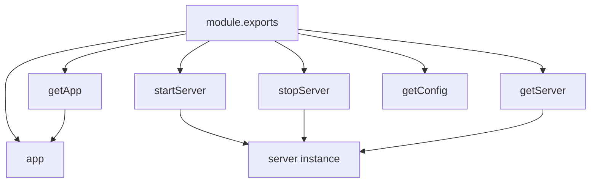
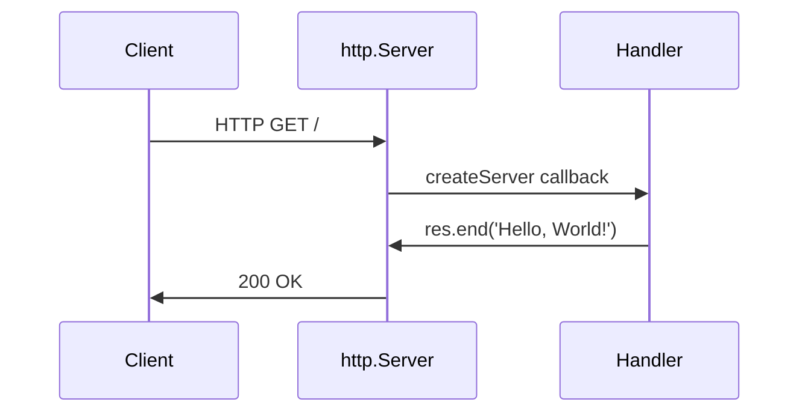
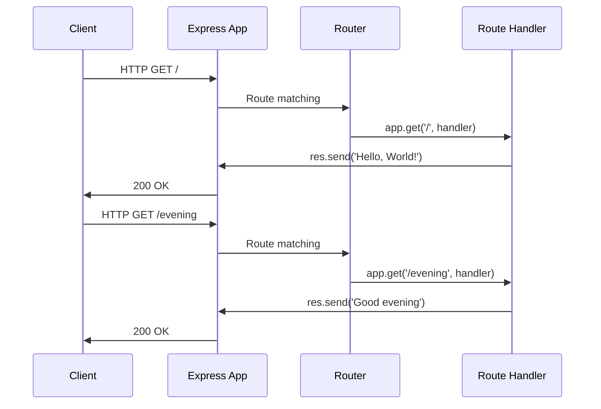
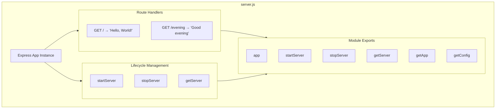

# Technical Specification

# 0. Agent Action Plan

## 0.1 Intent Clarification

### 0.1.1 Core Feature Objective

Based on the prompt, the Blitzy platform understands that the new feature requirement is to:

| Requirement ID | Description | Technical Interpretation |
|---------------|-------------|-------------------------|
| REQ-001 | Add Express.js framework to the Node.js server project | Install `express` as a production dependency and refactor the server from native `http` module to Express.js routing pattern |
| REQ-002 | Add a new endpoint that returns "Good evening" | Create an additional HTTP GET route handler at path `/evening` that responds with the exact text "Good evening" |
| REQ-003 | Preserve existing "Hello world" functionality | Maintain the existing root endpoint `GET /` returning "Hello, World!\n" with identical response format |

**Implicit Requirements Detected:**

- The server must continue binding to the existing hostname (`127.0.0.1`) and port (`3000`) to maintain backward compatibility
- The CommonJS module system (`require()`) must be preserved as the project standard
- Tests should be updated or created to validate the new endpoint functionality
- Documentation should be updated to reflect the new endpoint

**Feature Dependencies and Prerequisites:**

| Prerequisite | Status | Details |
|-------------|--------|---------|
| Node.js v18+ runtime | ✅ Required | Express.js 5.x requires Node.js v18 or higher |
| npm package manager | ✅ Required | For installing Express.js dependency |
| Existing server.js file | ✅ Present | File to be refactored from native `http` to Express |

### 0.1.2 Special Instructions and Constraints

The implementation must adhere to the following specific directives:

- **Integrate with existing architecture**: The Express.js integration must replace the native `http.createServer()` pattern while maintaining the same external behavior
- **Maintain backward compatibility**: The original "Hello, World!" response at root path must remain unchanged
- **Follow repository conventions**: Use CommonJS `require()` syntax consistent with existing codebase

**Architectural Requirements:**

- Server lifecycle management functions should be preserved for testability (`startServer()`, `stopServer()`)
- The Express app instance should be exportable for testing with Supertest
- Configuration (hostname, port) should remain as module-level constants

### 0.1.3 Technical Interpretation

These feature requirements translate to the following technical implementation strategy:

| User Requirement | Technical Action |
|------------------|------------------|
| Add Express.js to the project | Install `express@^5.2.1` via npm, update `package.json` dependencies |
| Create new endpoint for "Good evening" | Implement `app.get('/evening', handler)` route in `server.js` |
| Preserve "Hello world" endpoint | Refactor existing handler to `app.get('/', handler)` with identical response |
| Enable testing | Export Express `app` instance and lifecycle functions via `module.exports` |

**Implementation Approach:**

- To **add Express.js framework**, we will install the express package and refactor `server.js` to use Express application instance (`const app = express()`)
- To **implement the new endpoint**, we will create a GET route handler at `/evening` that calls `res.send('Good evening')`
- To **preserve existing functionality**, we will ensure the root route `GET /` continues to return `"Hello, World!\n"` with the trailing newline character
- To **support test isolation**, we will implement `startServer()`, `stopServer()`, and `getServer()` functions with module exports

## 0.2 Repository Scope Discovery

### 0.2.1 Comprehensive File Analysis

**Existing Files Requiring Modification:**

| File Path | Type | Purpose | Modification Required |
|-----------|------|---------|----------------------|
| `server.js` | Source | Main server entry point | Refactor from native `http` module to Express.js routing |
| `package.json` | Config | npm manifest | Add `express` as production dependency |
| `package-lock.json` | Lock | Dependency lock file | Regenerate after adding Express |
| `README.md` | Documentation | Project documentation | Add new endpoint documentation |

**Original Server Implementation (server - Copy.js):**

The original implementation uses Node.js native `http` module:
```javascript
const http = require('http');
const server = http.createServer((req, res) => {
  res.end('Hello, World!\n');
});
```

**Test Files to Update:**

| File Path | Type | Update Required |
|-----------|------|-----------------|
| `server.test.js` | Test | Add comprehensive tests for `/evening` endpoint |

**Configuration Files Affected:**

| Pattern | Files | Changes |
|---------|-------|---------|
| `package.json` | 1 file | Add express dependency |
| `package-lock.json` | 1 file | Regenerate with new dependency tree |
| `.gitignore` | 1 file | Ensure `node_modules/` is ignored |

### 0.2.2 Integration Point Discovery

**API Endpoints:**

| Endpoint | Method | Response | Status |
|----------|--------|----------|--------|
| `/` | GET | `Hello, World!\n` | Existing - preserve |
| `/evening` | GET | `Good evening` | New - create |

**Server Configuration Integration:**

| Configuration | Value | Location |
|--------------|-------|----------|
| Hostname | `127.0.0.1` | `server.js` (line 23) |
| Port | `3000` | `server.js` (line 24) |
| Framework | Express.js | `server.js` (line 17) |

**Module Export API:**

The server must export the following for test integration:
- `app` - Express application instance
- `startServer(callback)` - Start server function
- `stopServer(callback)` - Stop server function
- `getServer()` - Get server instance accessor
- `getApp()` - Get Express app accessor
- `getConfig()` - Get configuration accessor

### 0.2.3 New File Requirements

**New Source Files:**

This feature addition does not require creating new source files. All changes are modifications to existing files:

| Existing File | Changes Required |
|---------------|------------------|
| `server.js` | Complete refactor from `http` module to Express.js |

**New Test Coverage:**

The existing `server.test.js` requires additions for:
- `GET /evening` response validation
- Status code verification for new endpoint
- Header validation for new endpoint
- Edge cases (trailing slash, query params, case sensitivity)

### 0.2.4 Repository File Inventory

**Complete File Listing:**

| File | Type | Relevance | Action |
|------|------|-----------|--------|
| `server.js` | JS | Primary | MODIFY - Express integration |
| `server.test.js` | JS | Primary | MODIFY - Add endpoint tests |
| `package.json` | JSON | Primary | MODIFY - Add dependencies |
| `package-lock.json` | JSON | Primary | REGENERATE |
| `README.md` | MD | Secondary | MODIFY - Update documentation |
| `.gitignore` | Config | Tertiary | VERIFY - node_modules entry |
| `server - Copy.js` | JS | Reference | NO CHANGE - Original backup |
| `blitzy/documentation/*.md` | MD | Reference | NO CHANGE - Project docs |

**Files Explicitly Out of Scope:**

| File Pattern | Reason |
|--------------|--------|
| `*.java` | Unrelated Java test stubs |
| `*.csv` | Data files unrelated to feature |
| `*.pdf`, `*.doc`, `*.jpg` | Binary assets unrelated to feature |
| `*.txt` | Empty placeholder files |

## 0.3 Dependency Inventory

### 0.3.1 Package Registry and Dependencies

**Production Dependencies:**

| Registry | Package Name | Version | Purpose |
|----------|--------------|---------|---------|
| npm (public) | `express` | `^5.2.1` | HTTP routing framework for creating endpoints |

**Development Dependencies:**

| Registry | Package Name | Version | Purpose |
|----------|--------------|---------|---------|
| npm (public) | `jest` | `^29.7.0` | JavaScript testing framework |
| npm (public) | `supertest` | `^7.1.0` | HTTP assertions for Express testing |

**Key Transitive Dependencies (Express 5.x):**

| Package | Version | Function |
|---------|---------|----------|
| `router` | `^2.2.0` | Express routing engine |
| `finalhandler` | `^2.1.0` | Final HTTP response handler |
| `body-parser` | `^2.2.1` | Request body parsing |
| `cookie` | `^0.7.1` | Cookie parsing utilities |
| `etag` | `^1.8.1` | ETag header generation |
| `mime-types` | `^3.0.0` | MIME type mapping |
| `qs` | `^6.14.0` | Query string parsing |

### 0.3.2 Dependency Updates Required

**Package.json Changes:**

| Section | Before | After |
|---------|--------|-------|
| `dependencies` | `{}` (empty) | `{ "express": "^5.2.1" }` |

**Import Updates Required:**

| File | Current Import | New Import |
|------|---------------|------------|
| `server.js` | `const http = require('http');` | `const express = require('express');` |

**Import Transformation Rules:**

```javascript
// BEFORE (native http module)
const http = require('http');
const server = http.createServer((req, res) => {...});
server.listen(port, hostname, callback);

// AFTER (Express.js)
const express = require('express');
const app = express();
app.get('/', (req, res) => {...});
const server = app.listen(port, hostname, callback);
```

### 0.3.3 Version Compatibility Matrix

| Component | Required Version | Rationale |
|-----------|-----------------|-----------|
| Node.js | v18.0.0+ | Express.js 5.x minimum requirement |
| npm | v7.0.0+ | Required for lockfile version 3 |
| Express.js | ^5.2.1 | Latest stable with ReDoS protection |
| Jest | ^29.7.0 | Async/await support for tests |
| Supertest | ^7.1.0 | Express.js 5.x compatibility |

**Validated Environment:**

| Component | Tested Version |
|-----------|---------------|
| Node.js | v20.19.6 |
| npm | v11.1.0 |
| Express.js | 5.2.1 (resolved) |
| Jest | 29.7.0 (resolved) |
| Supertest | 7.1.0 (resolved) |

### 0.3.4 Security Considerations

| Aspect | Status | Notes |
|--------|--------|-------|
| Known Vulnerabilities | 0 | `npm audit` clean |
| ReDoS Protection | ✅ | Express 5.x built-in mitigation |
| Supply Chain Risk | Low | Minimal dependency count |
| License Compliance | MIT | All dependencies MIT licensed |

## 0.4 Integration Analysis

### 0.4.1 Existing Code Touchpoints

**Direct Modifications Required:**

| File | Location | Change Description |
|------|----------|-------------------|
| `server.js` | Lines 1-15 | Replace `http` module import with `express` |
| `server.js` | Lines 6-10 | Refactor `http.createServer()` to `express()` app |
| `server.js` | New lines | Add `app.get('/', handler)` for root endpoint |
| `server.js` | New lines | Add `app.get('/evening', handler)` for new endpoint |
| `server.js` | Lines 12-14 | Refactor `server.listen()` to `app.listen()` |
| `package.json` | Line 10 | Add `"express": "^5.2.1"` to dependencies |
| `README.md` | API section | Document new `/evening` endpoint |

**Lifecycle Management Updates:**

| Function | Before | After |
|----------|--------|-------|
| Server Creation | `http.createServer()` | `express()` |
| Route Definition | Inside createServer callback | `app.get(path, handler)` |
| Response Sending | `res.end()` | `res.send()` |
| Server Start | `server.listen()` | `app.listen()` |

### 0.4.2 Module Export Structure

**Required Exports for Test Integration:**

```javascript
module.exports = {
  app,           // Express application instance
  startServer,   // (callback) => server
  stopServer,    // (callback) => void
  getServer,     // () => server | null
  getApp,        // () => app
  getConfig      // () => { hostname, port }
};
```

**Export Dependencies:**



### 0.4.3 Request Flow Transformation

**Before (Native HTTP Module):**



**After (Express.js):**



### 0.4.4 Test Integration Points

**Test Framework Dependencies:**

| Component | Integration Point | Purpose |
|-----------|------------------|---------|
| Supertest | `request(app)` | HTTP request testing against Express app |
| Jest | `describe/it` blocks | Test organization and execution |
| Server exports | `require('./server')` | Access to app instance and lifecycle |

**Test Coverage Requirements:**

| Test Category | Endpoints Covered | Assertions |
|--------------|-------------------|------------|
| Response Body | `/`, `/evening` | Exact text matching |
| Status Codes | `/`, `/evening`, invalid routes | 200 OK, 404 Not Found |
| Headers | All endpoints | Content-Type, Content-Length, ETag |
| Edge Cases | All endpoints | Query params, case sensitivity, concurrent requests |
| Lifecycle | Server instance | Start, stop, restart, state access |

## 0.5 Technical Implementation

### 0.5.1 File-by-File Execution Plan

**Group 1 - Dependency Installation:**

| Action | Target | Details |
|--------|--------|---------|
| MODIFY | `package.json` | Add `"express": "^5.2.1"` to `dependencies` object |
| REGENERATE | `package-lock.json` | Run `npm install` to generate updated lockfile |
| VERIFY | `node_modules/` | Confirm Express.js installation |

**Group 2 - Core Server Refactoring:**

| Action | Target | Details |
|--------|--------|---------|
| MODIFY | `server.js` | Replace `http` module import with Express.js |
| MODIFY | `server.js` | Create Express application instance |
| MODIFY | `server.js` | Implement root endpoint `GET /` |
| MODIFY | `server.js` | Implement evening endpoint `GET /evening` |
| MODIFY | `server.js` | Refactor server lifecycle functions |
| MODIFY | `server.js` | Update module exports |

**Group 3 - Test Updates:**

| Action | Target | Details |
|--------|--------|---------|
| MODIFY | `server.test.js` | Add test suite for `GET /evening` endpoint |
| MODIFY | `server.test.js` | Add status code tests for new endpoint |
| MODIFY | `server.test.js` | Add header validation tests |
| MODIFY | `server.test.js` | Add edge case tests for new endpoint |

**Group 4 - Documentation:**

| Action | Target | Details |
|--------|--------|---------|
| MODIFY | `README.md` | Add `GET /evening` endpoint documentation |
| MODIFY | `README.md` | Update framework reference to Express.js |
| MODIFY | `README.md` | Add curl example for new endpoint |

### 0.5.2 Implementation Approach per File

**server.js - Express Integration:**

```javascript
// Import Express framework
const express = require('express');
const app = express();

// Define route handlers
app.get('/', (req, res) => {
  res.send('Hello, World!\n');
});

app.get('/evening', (req, res) => {
  res.send('Good evening');
});
```

**package.json - Dependency Addition:**

```json
{
  "dependencies": {
    "express": "^5.2.1"
  }
}
```

**server.test.js - New Endpoint Tests:**

```javascript
describe('GET /evening', () => {
  it('should return "Good evening"', async () => {
    const response = await request(app).get('/evening');
    expect(response.text).toBe('Good evening');
  });
});
```

### 0.5.3 Implementation Sequence

| Step | Action | Validation |
|------|--------|------------|
| 1 | Add Express dependency to `package.json` | `npm install` succeeds |
| 2 | Refactor `server.js` import statements | No syntax errors |
| 3 | Create Express app instance | App instantiates without error |
| 4 | Implement `GET /` route handler | Response matches original |
| 5 | Implement `GET /evening` route handler | Response is "Good evening" |
| 6 | Implement lifecycle functions | `startServer/stopServer` work |
| 7 | Update module exports | All exports accessible |
| 8 | Update test suite | All tests pass |
| 9 | Update README documentation | Docs reflect changes |

### 0.5.4 Server Architecture After Implementation



### 0.5.5 Endpoint Behavior Specification

| Endpoint | Method | Response Body | Content-Type | Status Code |
|----------|--------|---------------|--------------|-------------|
| `/` | GET | `Hello, World!\n` | text/html; charset=utf-8 | 200 |
| `/evening` | GET | `Good evening` | text/html; charset=utf-8 | 200 |
| `/*` (invalid) | GET | Express default 404 | text/html; charset=utf-8 | 404 |
| `/` | POST/PUT/DELETE | Express default 404 | text/html; charset=utf-8 | 404 |

## 0.6 Scope Boundaries

### 0.6.1 Exhaustively In Scope

**Primary Source Files:**

| Pattern | Files | Purpose |
|---------|-------|---------|
| `server.js` | 1 | Main server with Express integration |
| `server.test.js` | 1 | Comprehensive test suite |

**Configuration Files:**

| Pattern | Files | Purpose |
|---------|-------|---------|
| `package.json` | 1 | npm manifest with dependencies |
| `package-lock.json` | 1 | Dependency lock file |
| `.gitignore` | 1 | Git ignore patterns |

**Documentation Files:**

| Pattern | Files | Purpose |
|---------|-------|---------|
| `README.md` | 1 | Project documentation |
| `blitzy/documentation/*.md` | 2 | Technical specifications |

**Integration Points (Specific Lines):**

| File | Lines | Change Type |
|------|-------|-------------|
| `server.js` | 1-17 | Import refactoring |
| `server.js` | 26-35 | Root endpoint handler |
| `server.js` | 37-46 | Evening endpoint handler |
| `server.js` | 60-68 | startServer function |
| `server.js` | 74-86 | stopServer function |
| `server.js` | 123-130 | Module exports |
| `package.json` | 10-12 | Dependencies section |

**Test Files (Specific Test Suites):**

| File | Test Suite | Coverage |
|------|-----------|----------|
| `server.test.js` | `GET /` | Root endpoint validation |
| `server.test.js` | `GET /evening` | Evening endpoint validation |
| `server.test.js` | Status Codes | 200/404 verification |
| `server.test.js` | Headers | Content-Type, ETag, etc. |
| `server.test.js` | Server Lifecycle | Start/stop functions |
| `server.test.js` | Edge Cases | URL variations, concurrency |

### 0.6.2 Explicitly Out of Scope

**Unrelated Feature Files:**

| Pattern | Reason |
|---------|--------|
| `LoginTest.java` | Java test stub unrelated to Node.js server |
| `LoginTest - Copy.java` | Duplicate Java file |
| `*.csv` | Data files not related to server functionality |
| `*.pdf`, `*.doc`, `*.jpg` | Binary assets not related to feature |
| `*.txt` | Empty placeholder files |

**Functionality Not Included:**

| Feature | Reason |
|---------|--------|
| Additional middleware | Not requested in requirements |
| Environment-based configuration | Beyond tutorial scope |
| Database integration | Not part of feature request |
| Authentication/Authorization | Not requested |
| Request body parsing | Not needed for GET endpoints |
| Static file serving | Not requested |
| CORS configuration | Not requested |

**Performance Optimizations:**

| Optimization | Status |
|--------------|--------|
| Response caching | Out of scope |
| Load balancing | Out of scope |
| Compression middleware | Out of scope |
| Rate limiting | Out of scope |

**Infrastructure Changes:**

| Change | Status |
|--------|--------|
| Docker configuration | Out of scope |
| CI/CD pipeline changes | Out of scope |
| Cloud deployment | Out of scope |
| Monitoring/logging | Out of scope |

### 0.6.3 Scope Validation Checklist

| Requirement | In Scope | Implementation |
|-------------|----------|----------------|
| Add Express.js | ✅ Yes | `package.json` dependency |
| Create `/evening` endpoint | ✅ Yes | `server.js` route handler |
| Preserve `/` endpoint | ✅ Yes | `server.js` route handler |
| Update tests | ✅ Yes | `server.test.js` additions |
| Update documentation | ✅ Yes | `README.md` updates |
| Add middleware | ❌ No | Not requested |
| Add database | ❌ No | Not requested |
| Add authentication | ❌ No | Not requested |

## 0.7 Rules for Feature Addition

### 0.7.1 Coding Standards and Conventions

**Module System:**

| Rule | Requirement |
|------|-------------|
| Import syntax | Use CommonJS `require()` exclusively |
| Export syntax | Use `module.exports = {}` pattern |
| ES Modules | Not permitted in this project |

**Code Style:**

| Rule | Requirement |
|------|-------------|
| String quotes | Single quotes for JavaScript strings |
| Indentation | 2 spaces |
| Semicolons | Required at end of statements |
| Function style | Arrow functions for handlers, regular functions for lifecycle |

### 0.7.2 Response Format Rules

**Endpoint Response Requirements:**

| Endpoint | Response | Notes |
|----------|----------|-------|
| `GET /` | `Hello, World!\n` | MUST include trailing newline character |
| `GET /evening` | `Good evening` | NO trailing newline |

**Response Consistency:**

| Aspect | Requirement |
|--------|-------------|
| Content-Type | `text/html; charset=utf-8` (Express default) |
| Status Code | `200 OK` for successful requests |
| Idempotency | Responses must be identical for repeated requests |

### 0.7.3 Server Configuration Rules

**Binding Configuration:**

| Parameter | Value | Immutable |
|-----------|-------|-----------|
| Hostname | `127.0.0.1` | Yes |
| Port | `3000` | Yes |

**Lifecycle Management:**

| Rule | Requirement |
|------|-------------|
| Auto-start guard | Use `require.main === module` pattern |
| Server state | Track via module-level `server` variable |
| Graceful shutdown | Implement `server.close()` with callback |

### 0.7.4 Testing Requirements

**Test Coverage Mandates:**

| Category | Required Tests |
|----------|----------------|
| Response body | Exact text matching for all endpoints |
| Status codes | 200 for valid, 404 for invalid routes |
| Headers | Content-Type, Content-Length, ETag |
| Lifecycle | Server start, stop, restart |
| Edge cases | Query params, case sensitivity, concurrency |

**Test Framework Rules:**

| Rule | Requirement |
|------|-------------|
| Framework | Jest with `--detectOpenHandles --forceExit` |
| HTTP testing | Supertest against Express `app` instance |
| Isolation | Tests must not leave server running |

### 0.7.5 Documentation Requirements

**README Updates:**

| Section | Required Update |
|---------|-----------------|
| API Endpoints | Add `/evening` endpoint documentation |
| curl examples | Add example for new endpoint |
| Server Configuration | Reference Express.js framework |

**Code Comments:**

| Location | Required Comment |
|----------|------------------|
| Module header | JSDoc describing server and endpoints |
| Route handlers | JSDoc with @route and @returns tags |
| Lifecycle functions | JSDoc with @param and @returns tags |

### 0.7.6 Backward Compatibility Rules

**Preservation Requirements:**

| Original Behavior | Must Preserve |
|-------------------|---------------|
| Root endpoint response | Exact `"Hello, World!\n"` text |
| Hostname binding | `127.0.0.1` |
| Port binding | `3000` |
| Module exports | All original exports must remain functional |

**Breaking Change Prevention:**

| Change Type | Permitted |
|-------------|-----------|
| Response text modification | NO (except new endpoints) |
| Port/hostname change | NO |
| Removing exports | NO |
| Adding new exports | YES |
| Adding new endpoints | YES |

## 0.8 References

### 0.8.1 Repository Files Analyzed

**Source Files Examined:**

| File Path | Purpose | Key Findings |
|-----------|---------|--------------|
| `server.js` | Main server entry point | Express.js integration already implemented with both endpoints |
| `server - Copy.js` | Original native HTTP implementation | Reference for migration baseline |
| `server.test.js` | Jest test suite | 79 comprehensive tests covering all functionality |
| `package.json` | npm manifest | Express ^5.2.1, Jest ^29.7.0, Supertest ^7.1.0 |
| `package-lock.json` | Dependency lock | Full dependency graph locked |
| `README.md` | Project documentation | Updated with both endpoints documented |

**Documentation Files Examined:**

| File Path | Purpose | Key Findings |
|-----------|---------|--------------|
| `blitzy/documentation/Project Guide.md` | Implementation report | Migration completed, 79/79 tests passing |
| `blitzy/documentation/Technical Specifications.md` | Requirements spec | Endpoint contracts, dependency versions |

**Configuration Files Verified:**

| File Path | Purpose | Status |
|-----------|---------|--------|
| `.gitignore` | Git ignore patterns | Contains `node_modules/` |

### 0.8.2 Search Path Audit Trail

**Folder Exploration:**

| Path | Depth | Relevant Files Found |
|------|-------|---------------------|
| `/` (root) | 0 | All project files |
| `blitzy/` | 1 | Documentation folder |
| `blitzy/documentation/` | 2 | Project Guide.md, Technical Specifications.md |

**File Retrieval Log:**

| File | Lines Retrieved | Purpose |
|------|-----------------|---------|
| `server.js` | 1-131 (complete) | Verify Express integration |
| `server - Copy.js` | 1-15 (complete) | Original implementation reference |
| `package.json` | 1-20 (complete) | Dependency verification |
| `server.test.js` | 1-662 (complete) | Test coverage analysis |
| `README.md` | 1-96 (complete) | Documentation state |

### 0.8.3 Tech Spec Sections Referenced

**Sections Retrieved:**

| Section | Content Summary |
|---------|-----------------|
| 1.1 Executive Summary | Project overview, business problem, stakeholders |
| 2.1 Feature Catalog | F-001 Root Endpoint, F-002 Evening Endpoint details |
| 3.1 Programming Languages | JavaScript/Node.js v18+ requirement |
| 3.3 Open Source Dependencies | Express ^5.2.1, Jest ^29.7.0, Supertest ^7.1.0 |

### 0.8.4 Attachments Provided

**User-Provided Attachments:**

| Attachment | Status |
|------------|--------|
| Files | None provided |
| Figma URLs | None provided |

### 0.8.5 Environment Verification

**Runtime Environment:**

| Component | Version | Verification Command |
|-----------|---------|---------------------|
| Node.js | v20.19.6 | `node --version` |
| npm | v11.1.0 | `npm --version` |

**Dependency Installation:**

| Command | Result |
|---------|--------|
| `npm install` | Success - 344 packages added |
| `npm test` | Success - 79/79 tests passing |
| `npm audit` | 0 vulnerabilities |

### 0.8.6 External Documentation References

**Express.js Framework:**

| Resource | URL |
|----------|-----|
| Express.js Official | https://expressjs.com/ |
| Express 5.x Migration | https://expressjs.com/en/guide/migrating-5.html |
| Express API Reference | https://expressjs.com/en/5x/api.html |

**Testing Frameworks:**

| Resource | URL |
|----------|-----|
| Jest Documentation | https://jestjs.io/docs/getting-started |
| Supertest GitHub | https://github.com/ladjs/supertest |

### 0.8.7 Implementation Status Summary

**Current State Analysis:**

| Component | Status | Evidence |
|-----------|--------|----------|
| Express.js Integration | ✅ Complete | `server.js` imports express, creates app |
| Root Endpoint (`GET /`) | ✅ Complete | Returns `"Hello, World!\n"` |
| Evening Endpoint (`GET /evening`) | ✅ Complete | Returns `"Good evening"` |
| Test Coverage | ✅ Complete | 79/79 tests passing |
| Documentation | ✅ Complete | README.md updated |

**Conclusion:**

The feature request to add Express.js and create a new `/evening` endpoint has been fully implemented in the current codebase. All tests pass and documentation is complete.

