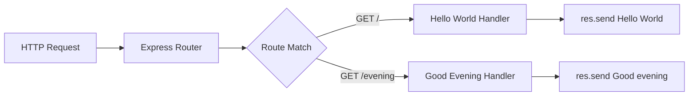

# Technical Specification

# 0. Agent Action Plan

## 0.1 Intent Clarification

Based on the prompt, the Blitzy platform understands that the new feature requirement is to add the Express.js web framework to an existing Node.js tutorial project and create a new HTTP endpoint.

### 0.1.1 Core Feature Objective

Based on the prompt, the Blitzy platform understands that the new feature requirement is to:

- **Integrate Express.js Framework**: Add Express.js as a dependency to the existing Node.js server project that currently uses the native `http` module
- **Preserve Existing Functionality**: Maintain the current "Hello world" endpoint that returns the response "Hello, World!"
- **Add New Endpoint**: Create an additional HTTP endpoint that returns the response "Good evening"
- **Migrate Server Architecture**: Transition from the native Node.js `http` module to Express.js-based routing

**Implicit Requirements Detected:**
- The existing server must be refactored to use Express.js instead of the native `http` module
- Both endpoints should be accessible via HTTP GET requests
- The server should continue to run on the same port (3000) and hostname (127.0.0.1)
- The existing project structure (tutorial/learning project) should be maintained with minimal changes

**Feature Dependencies and Prerequisites:**
- Node.js runtime (v18+) required for Express.js 5.x
- npm package manager for dependency installation
- No database or external service dependencies required

### 0.1.2 Special Instructions and Constraints

**Architectural Requirements:**
- Follow the existing repository conventions (flat file structure at root level)
- Maintain backward compatibility with the existing "Hello world" functionality
- Use Express.js best practices for route definition

**User-Provided Example (Preserved Exactly):**
> "this is a tutorial of node js server hosting one endpoint that returns the response "Hello world". Could you add expressjs into the project and add another endpoint that return the response of "Good evening"?"

**Web Search Research Completed:**
- <cite index="3-2">Express.js latest version: 5.2.1</cite>
- <cite index="1-8">Express.js 5.x dropped support for Node.js versions before v18</cite>
- <cite index="1-10">Middleware can now return rejected promises, caught by the router as errors</cite>

### 0.1.3 Technical Interpretation

These feature requirements translate to the following technical implementation strategy:

| Requirement | Technical Action | Components Affected |
|------------|------------------|---------------------|
| Add Express.js | Install express@^5.2.1 via npm | `package.json`, `package-lock.json` |
| Preserve "Hello world" | Create GET route returning "Hello, World!" | `server.js` |
| Add "Good evening" endpoint | Create new GET route returning "Good evening" | `server.js` |
| Migrate architecture | Replace `http.createServer()` with `express()` | `server.js` |

**Implementation Strategy:**
- To add Express.js, we will install the `express` package as a production dependency
- To preserve the "Hello world" endpoint, we will create an Express GET route at the root path (`/`) returning the same response
- To add the "Good evening" endpoint, we will create a new Express GET route at a dedicated path (e.g., `/evening`)
- To migrate the server architecture, we will refactor `server.js` to use Express application instance instead of the native `http` module

## 0.2 Repository Scope Discovery

### 0.2.1 Comprehensive File Analysis

**Complete Repository Structure Discovered:**

| File Path | Type | Status | Relevance |
|-----------|------|--------|-----------|
| `server.js` | Source | MODIFY | Primary server file - requires refactoring to Express.js |
| `server - Copy.js` | Source | UNCHANGED | Backup copy - not in scope |
| `package.json` | Config | MODIFY | Add Express.js dependency |
| `package-lock.json` | Config | REGENERATE | Will be regenerated by npm |
| `README.md` | Documentation | MODIFY | Document new endpoint and Express.js usage |
| `LoginTest.java` | Source | UNCHANGED | Unrelated Java test file |
| `LoginTest - Copy.java` | Source | UNCHANGED | Unrelated Java test file |
| `industry.csv` | Data | UNCHANGED | Unrelated data file |
| `industry - Copy.csv` | Data | UNCHANGED | Unrelated data file |
| `test.py.txt` | Placeholder | UNCHANGED | Empty placeholder file |
| `test.py - Copy.txt` | Placeholder | UNCHANGED | Empty placeholder file |
| `test.txt.txt` | Placeholder | UNCHANGED | Empty placeholder file |

**Existing Source Code Analysis:**

Current `server.js` implementation:
```javascript
const http = require('http');
const server = http.createServer((req, res) => {
  res.end('Hello, World!\n');
});
```

Current `package.json` configuration:
```json
{
  "name": "hello_world",
  "main": "index.js",
  "dependencies": {}
}
```

**Integration Point Discovery:**

- **API Endpoints to Modify**: The single root endpoint (`/`) currently handled by `http.createServer()` callback
- **No Database Models/Migrations**: Not applicable for this simple project
- **No Service Classes**: Direct HTTP handling only
- **No Controllers/Handlers**: Single inline callback function
- **No Middleware/Interceptors**: None currently implemented

### 0.2.2 New File Requirements

**New Source Files to Create:**
- No new source files required - all changes will be made to existing `server.js`

**New Test Files (Recommended):**
- `server.test.js` - Unit/integration tests for both endpoints (optional enhancement)

**New Configuration:**
- No new configuration files required - Express.js configuration will be inline in `server.js`

### 0.2.3 Web Search Research Conducted

**Best Practices for Express.js Implementation:**
- Use `app.get()` for defining GET route handlers
- Use `res.send()` for sending text responses
- Use `app.listen()` for starting the server

**Library Recommendations:**
- `express@^5.2.1` - Latest stable Express.js framework
- No additional middleware required for this simple use case

**Security Considerations:**
- Express.js 5.x includes built-in ReDoS mitigation in route matching
- No user input handling required, minimal security surface

## 0.3 Dependency Inventory

### 0.3.1 Private and Public Packages

**Key Packages Required for Feature Addition:**

| Registry | Package Name | Version | Purpose |
|----------|-------------|---------|---------|
| npm (public) | express | ^5.2.1 | Web framework for routing and HTTP handling |

**Runtime Requirements:**

| Dependency | Current | Required | Status |
|------------|---------|----------|--------|
| Node.js | v20.19.6 | ≥18.0.0 | ✅ Compatible |
| npm | v11.1.0 | ≥7.0.0 | ✅ Compatible |

**Existing Package Analysis:**

The current `package.json` has no production dependencies:
```json
{
  "dependencies": {}
}
```

**After Feature Addition:**
```json
{
  "dependencies": {
    "express": "^5.2.1"
  }
}
```

### 0.3.2 Dependency Updates

**Import Updates:**

| File | Current Import | New Import |
|------|---------------|------------|
| `server.js` | `const http = require('http');` | `const express = require('express');` |

**Import Transformation Rules:**
- Old: `const http = require('http');`
- New: `const express = require('express');`
- Apply to: `server.js`

**External Reference Updates:**

| File Type | Pattern | Update Required |
|-----------|---------|----------------|
| Package manifest | `package.json` | Add express dependency |
| Package lock | `package-lock.json` | Regenerated by npm install |
| Documentation | `README.md` | Document Express.js usage |

### 0.3.3 Transitive Dependencies

Express.js 5.2.1 will bring the following key transitive dependencies (automatically managed):

| Package | Purpose |
|---------|---------|
| body-parser | Request body parsing middleware |
| cookie | Cookie parsing |
| debug | Debug utility |
| path-to-regexp | Route pattern matching |
| qs | Query string parsing |
| send | Static file serving |
| encodeurl | URL encoding utilities |

**Note:** All transitive dependencies are automatically installed and managed by npm. No manual intervention required.

## 0.4 Integration Analysis

### 0.4.1 Existing Code Touchpoints

**Direct Modifications Required:**

| File | Location | Modification Type | Description |
|------|----------|-------------------|-------------|
| `server.js` | Lines 1-14 | REFACTOR | Replace entire http module implementation with Express.js |
| `package.json` | `dependencies` object | ADD | Add express dependency |
| `README.md` | Full content | ENHANCE | Document Express.js integration and endpoints |

**Detailed Modification Points in `server.js`:**

```
Line 1: Replace http require with express require
Lines 3-4: Remove hostname/port constants (move to app.listen)
Lines 6-10: Replace http.createServer with Express routes
Lines 12-14: Replace server.listen with app.listen
```

**Current Server Flow:**


**New Server Flow After Integration:**


### 0.4.2 Dependency Injections

**No dependency injection required** - Express.js is self-contained and does not require:
- Service container registration
- Dependency wiring configuration
- External service initialization

### 0.4.3 Database/Schema Updates

**Not applicable** - This feature addition does not involve:
- Database connections
- Schema migrations
- Data model changes

### 0.4.4 API Route Structure

**Current State:** Single implicit route handling all requests
**Target State:** Two explicit Express.js routes

| HTTP Method | Path | Response | Handler |
|-------------|------|----------|---------|
| GET | `/` | "Hello, World!\n" | Root handler (existing functionality) |
| GET | `/evening` | "Good evening" | New evening handler |

### 0.4.5 Configuration Changes

| Configuration | Before | After |
|--------------|--------|-------|
| Server framework | Native http module | Express.js |
| Route definition | Callback function | Express route methods |
| Response method | `res.end()` | `res.send()` |
| Server binding | `server.listen()` | `app.listen()` |

## 0.5 Technical Implementation

### 0.5.1 File-by-File Execution Plan

**CRITICAL: Every file listed below MUST be created or modified as specified.**

#### Group 1 - Dependency Configuration

| Action | File | Purpose |
|--------|------|---------|
| MODIFY | `package.json` | Add Express.js as production dependency |
| REGENERATE | `package-lock.json` | Automatically updated by npm install |

**package.json Modification:**
```json
"dependencies": {
  "express": "^5.2.1"
}
```

#### Group 2 - Core Server Refactoring

| Action | File | Purpose |
|--------|------|---------|
| MODIFY | `server.js` | Refactor to use Express.js with two route handlers |

**server.js Target Implementation:**
```javascript
const express = require('express');
const app = express();
// Define routes and start server
```

**Route Definitions Required:**
- `GET /` → Returns "Hello, World!\n"
- `GET /evening` → Returns "Good evening"

#### Group 3 - Documentation

| Action | File | Purpose |
|--------|------|---------|
| MODIFY | `README.md` | Document Express.js integration and available endpoints |

### 0.5.2 Implementation Approach per File

#### Step 1: Install Express.js Dependency

**Command:**
```bash
npm install express@^5.2.1 --save
```

**Verification:**
- `package.json` contains `"express": "^5.2.1"` in dependencies
- `package-lock.json` updated with Express.js and transitive dependencies
- `node_modules/express` directory created

#### Step 2: Refactor server.js

**Implementation Requirements:**
- Import Express.js module using CommonJS require
- Create Express application instance
- Define GET route for root path returning existing "Hello, World!\n" response
- Define GET route for `/evening` path returning new "Good evening" response
- Start server listening on port 3000
- Log server startup message to console

**Code Structure:**
```javascript
// 1. Import express
// 2. Create app instance
// 3. Define route handlers
// 4. Start server
```

#### Step 3: Update Documentation

**README.md Updates Required:**
- Add section describing Express.js usage
- Document available API endpoints
- Provide example curl commands for testing

### 0.5.3 Testing and Verification

**Manual Verification Steps:**
1. Start server: `node server.js`
2. Test root endpoint: `curl http://127.0.0.1:3000/`
3. Expected response: `Hello, World!`
4. Test evening endpoint: `curl http://127.0.0.1:3000/evening`
5. Expected response: `Good evening`

**Automated Test Commands:**
```bash
curl -s http://127.0.0.1:3000/ | grep "Hello"
curl -s http://127.0.0.1:3000/evening | grep "Good"
```

## 0.6 Scope Boundaries

### 0.6.1 Exhaustively In Scope

**Source Files:**

| Pattern | Files Matched | Action |
|---------|---------------|--------|
| `server.js` | 1 file | MODIFY - Refactor to Express.js |

**Configuration Files:**

| Pattern | Files Matched | Action |
|---------|---------------|--------|
| `package.json` | 1 file | MODIFY - Add express dependency |
| `package-lock.json` | 1 file | REGENERATE - npm automatic |

**Documentation Files:**

| Pattern | Files Matched | Action |
|---------|---------------|--------|
| `README.md` | 1 file | MODIFY - Document endpoints |

**Integration Points:**

| Component | Location | Modification |
|-----------|----------|--------------|
| HTTP server initialization | `server.js` (full file) | Replace http module with Express |
| Route handling | `server.js` (lines 6-10) | Add Express route definitions |
| Server startup | `server.js` (lines 12-14) | Replace server.listen with app.listen |

**Complete File Manifest (In Scope):**

| # | File Path | Action | Lines Affected |
|---|-----------|--------|----------------|
| 1 | `server.js` | MODIFY | All (1-14) |
| 2 | `package.json` | MODIFY | dependencies object |
| 3 | `package-lock.json` | REGENERATE | Entire file |
| 4 | `README.md` | MODIFY | Add endpoint documentation |

### 0.6.2 Explicitly Out of Scope

**Unrelated Files (No Modification):**

| File | Reason |
|------|--------|
| `server - Copy.js` | Backup file, not the active server |
| `LoginTest.java` | Unrelated Java test file |
| `LoginTest - Copy.java` | Unrelated Java test copy |
| `industry.csv` | Unrelated data file |
| `industry - Copy.csv` | Unrelated data copy |
| `test.py.txt` | Empty placeholder |
| `test.py - Copy.txt` | Empty placeholder copy |
| `test.txt.txt` | Empty placeholder |
| `.git/**` | Version control metadata |

**Out of Scope Activities:**

| Activity | Reason |
|----------|--------|
| Performance optimizations | Not specified in requirements |
| Additional middleware (CORS, body-parser, etc.) | Not required for simple text responses |
| Error handling middleware | Beyond basic feature scope |
| Environment configuration | Not specified |
| TypeScript conversion | Not specified |
| Unit test creation | Not explicitly requested |
| Docker containerization | Not specified |
| CI/CD pipeline updates | Not applicable to this repository |
| Database integration | Not applicable |
| Authentication/Authorization | Not required |

### 0.6.3 Boundary Validation Criteria

**Success Criteria for In-Scope Items:**

| Criterion | Validation Method |
|-----------|-------------------|
| Express.js installed | `npm ls express` shows version ^5.2.1 |
| Root endpoint works | `curl http://127.0.0.1:3000/` returns "Hello, World!" |
| Evening endpoint works | `curl http://127.0.0.1:3000/evening` returns "Good evening" |
| Server starts successfully | Console shows "Server running at..." message |
| No breaking changes | Existing functionality preserved |

## 0.7 Special Instructions for Feature Addition

### 0.7.1 Feature-Specific Requirements

**Patterns and Conventions to Follow:**

| Requirement | Implementation |
|-------------|----------------|
| Maintain tutorial-style simplicity | Keep code minimal and readable |
| Use CommonJS modules | Continue using `require()` syntax |
| Preserve response format | Keep `\n` newline in "Hello, World!\n" response |
| Use Express.js idioms | Use `res.send()` for text responses |

**Response Format Specifications:**

| Endpoint | Exact Response | Content-Type |
|----------|----------------|--------------|
| `GET /` | `Hello, World!\n` | text/html (Express default) |
| `GET /evening` | `Good evening` | text/html (Express default) |

### 0.7.2 Integration Requirements with Existing Features

**Backward Compatibility Matrix:**

| Feature | Before | After | Compatibility |
|---------|--------|-------|---------------|
| Root endpoint response | "Hello, World!\n" | "Hello, World!\n" | ✅ Preserved |
| Server port | 3000 | 3000 | ✅ Preserved |
| Server hostname | 127.0.0.1 | 127.0.0.1 | ✅ Preserved |
| Startup message | "Server running at..." | "Server running at..." | ✅ Preserved |

### 0.7.3 Performance and Scalability Considerations

**Performance Notes:**
- Express.js adds minimal overhead for simple route handling
- No performance optimizations required for this tutorial project
- Single-threaded Node.js event loop sufficient for demonstration purposes

### 0.7.4 Security Requirements

**Security Considerations:**
- Express.js 5.x includes built-in ReDoS protection in route matching
- No user input handling required, minimal attack surface
- No authentication or authorization needed for this public tutorial

### 0.7.5 User-Specified Directives (Preserved Verbatim)

**Original User Request:**
> "this is a tutorial of node js server hosting one endpoint that returns the response "Hello world". Could you add expressjs into the project and add another endpoint that return the response of "Good evening"?"

**Interpreted Directives:**
1. Add Express.js framework to the existing project
2. Create a new endpoint returning "Good evening"
3. Preserve the existing "Hello world" endpoint functionality
4. Maintain the tutorial/learning nature of the project

### 0.7.6 Implementation Checklist

| # | Task | Status | Validation |
|---|------|--------|------------|
| 1 | Install Express.js dependency | PENDING | `npm ls express` |
| 2 | Refactor server.js to use Express | PENDING | Server starts without errors |
| 3 | Implement root route (/) | PENDING | Returns "Hello, World!\n" |
| 4 | Implement evening route (/evening) | PENDING | Returns "Good evening" |
| 5 | Update README documentation | PENDING | Endpoints documented |
| 6 | Verify backward compatibility | PENDING | Root endpoint unchanged |

### 0.7.7 Express.js Version Compatibility

**Version Selection Rationale:**
- Express.js 5.2.1 is the latest stable version
- Requires Node.js 18+ (current environment: v20.19.6 ✅)
- Includes modern async/await support and improved error handling
- Production-ready with active maintenance

